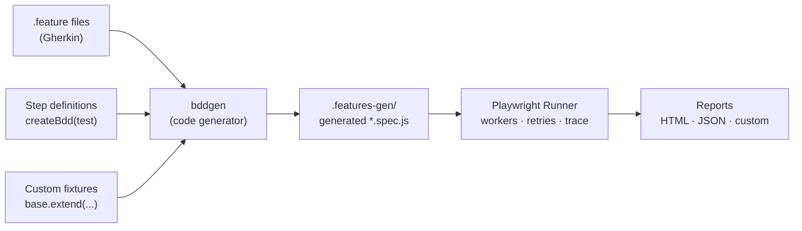
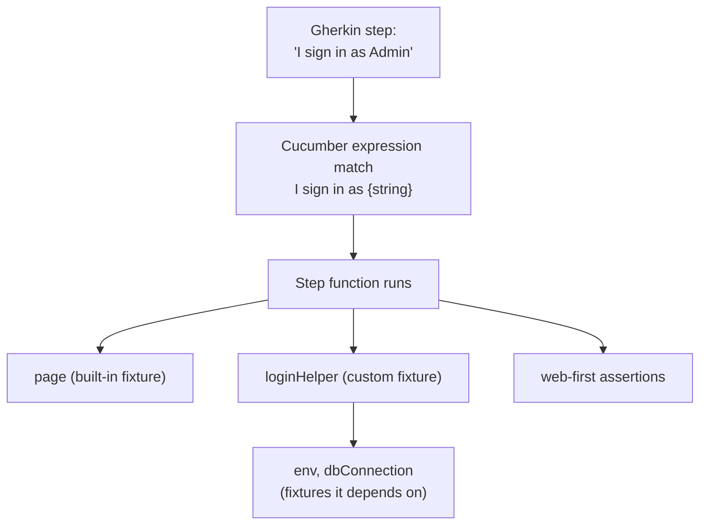
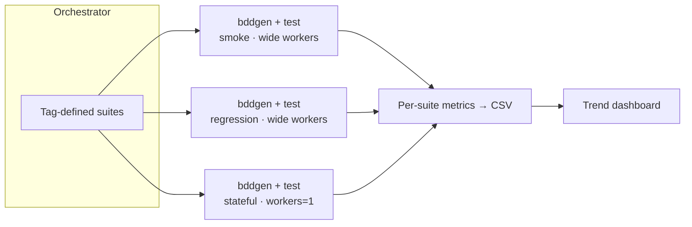

# Scaling Playwright‑BDD to 3,000+ Tests Without Losing Your Mind

> How we structured fixtures, steps, and tags to keep a large Behaviour‑Driven test suite fast, readable, and maintainable.

Most teams that adopt Behaviour‑Driven Development (BDD) start with a handful of `.feature` files and a warm feeling of "our tests read like English now." Then the suite grows. A few hundred scenarios in, the cracks appear: duplicated step definitions, a single 2,000‑line "world" object, flaky shared state, and a CI run that takes longer than the lunch break it was supposed to fit into.

This article is about the patterns that let a single repository carry **3,000+ tests** on top of [playwright-bdd](https://github.com/vitalets/playwright-bdd) while staying fast and maintainable. It is deliberately framework‑focused — no product specifics, just the architecture.

If you already use Playwright but write your tests in raw `test()` blocks, or you use Cucumber.js and envy Playwright's tooling, this is the bridge.

---

## Why Playwright‑BDD instead of Cucumber.js?

Classic Cucumber.js gives you Gherkin and step definitions, but you bolt on your own browser driver, your own parallelism, and your own reporting. Playwright‑BDD flips the model: it **generates native Playwright test files from your `.feature` files**, then hands execution back to the Playwright runner.

That single design decision is what makes scale possible. You keep the business‑readable Gherkin layer, but underneath you inherit everything the Playwright runner already does well:

- True parallel execution with workers
- Auto‑waiting and web‑first assertions
- Trace Viewer, video, and screenshots on failure
- Built‑in sharding and retries
- The `fixtures` dependency‑injection system (the real hero of this story)



The crucial mental model: **`bddgen` is a build step.** It runs before `playwright test`, transforming Gherkin into real spec files in a generated folder. You never edit those files; you regenerate them. Your CI command is always two stages:

```bash
npx bddgen --tags "@smoke and not @manual"
npx playwright test --project=chromium
```

---

## The configuration that ties it together

Everything starts in `playwright.config.js`. `defineBddConfig` tells the generator three things: where the features live, where the steps live, and which test object (with your fixtures) to import.

```js
import { defineConfig } from "@playwright/test";
import { defineBddConfig } from "playwright-bdd";

const testDir = defineBddConfig({
  features: "tests/features/**/*.feature",
  importTestFrom: "tests/fixtures/fixtures.js",
  steps: ["tests/steps/**/*.js", "tests/fixtures/fixtures.js"],
});

export default defineConfig({
  testDir, // <-- the generated specs, not your features
  fullyParallel: true,
  workers: process.env.CI ? 4 : 2,
  retries: process.env.CI ? 1 : 0,
  reporter: [
    ["html"],
    ["json", { outputFile: "report.json" }],
    ["list"],
  ],
});
```

The line that trips people up is `testDir = defineBddConfig(...)`. The runner is not pointed at your `.feature` files — it is pointed at the **generated** spec directory. The feature files are an input to a compiler, not the thing executed.

---

## Pattern 1 — Fixtures as composable dependency injection

This is the single most important pattern for scaling BDD. In naive Cucumber you accumulate state on a giant `World` object. In Playwright‑BDD you instead express every piece of test context as a **fixture** — a lazily‑instantiated, automatically‑cleaned‑up dependency that steps request by name.

The mistake most teams make is putting every fixture in one file. At 3,000 tests that file becomes unmergeable. Instead, split fixtures by domain and compose them:

```js
// tests/fixtures/fixtures.js
import { base } from "./shared/common-imports.js";
import { baseFixtures } from "./shared/base-fixtures.js";
import { utilityFixtures } from "./shared/utility-fixtures.js";
import { adminFixtures } from "./admin/admin-fixtures.js";
import { apiFixtures } from "./api/api-fixtures.js";
import { checkoutFixtures } from "./checkout/checkout-fixtures.js";

export const test = base.extend({
  ...baseFixtures,
  ...utilityFixtures,
  ...adminFixtures,
  ...apiFixtures,
  ...checkoutFixtures,
});
```

Each domain owns a small file that exports a plain object of fixtures. The root file is just composition. New team adds a feature area? They add a file and one spread line — no merge conflicts in shared code.

A fixture itself is a function that *sets up*, calls `use(value)`, then *tears down*:

```js
export const baseFixtures = {
  // Derive a value from another fixture (viewport is built in)
  isSmallViewPort: async ({ viewport }, use) => {
    await use(viewport && viewport.width < 768);
  },

  // Read configuration once, share it everywhere
  env: async ({}, use) => {
    await use(process.env.ENV || "qa");
  },

  // Set up + guaranteed teardown, even if the test fails
  seededAccount: async ({ dbConnection, env }, use) => {
    const account = await createAccount(dbConnection, env);
    await use(account);             // test runs here
    await deleteAccount(dbConnection, account.id); // always cleans up
  },
};
```

Three properties make this scale:

1. **Lazy** — a fixture is only created if a step in that scenario actually asks for it. A scenario that never touches the database never opens a connection.
2. **Cached per test** — request `seededAccount` from five steps and you get the *same* instance.
3. **Auto‑teardown** — anything after `use()` runs as cleanup, in reverse order, regardless of pass/fail. No more leaked rows or orphaned sessions.

### A shared scratchpad for cross‑step state

Gherkin steps are deliberately stateless functions, but a scenario often needs to carry a value from one step to the next (a generated ID, a captured timestamp). Rather than reaching for globals, expose a small per‑test cache as a fixture:

```js
runTimeCache: async ({}, use) => {
  await use(new RunTimeCache()); // fresh Map-like object per test
},
```

```gherkin
Given I note the current server time
When I submit the form
Then the record timestamp is after the noted time
```

Each step reads/writes `runTimeCache`. Because it is a fixture, it is automatically isolated per test — parallel workers can never stomp on each other's state. This is the disciplined replacement for Cucumber's mutable `World`.

---

## Pattern 2 — Steps bound to your custom test

Steps are defined with `createBdd(test)`, passing in the *composed* test object so every step has typed access to your fixtures via destructuring:

```js
import { createBdd } from "playwright-bdd";
import { test } from "../../fixtures/fixtures";

const { Given, When, Then } = createBdd(test);

Given("I wait for {int} seconds", async ({}, seconds) => {
  await new Promise((r) => setTimeout(r, seconds * 1000));
});

When("I sign in as {string}", async ({ page, loginHelper }, role) => {
  await loginHelper.signIn(page, role);
});

Then("I see the {string} confirmation page", async ({ confirmationPage }, id) => {
  await confirmationPage.assertVisible(id);
});
```

Notice that `page`, `loginHelper`, and `confirmationPage` all arrive through the first destructured argument — they are fixtures. The step never constructs a page object or a browser page; it just asks for what it needs. This keeps step bodies tiny and makes the dependency graph explicit.

The `{int}` and `{string}` placeholders are **Cucumber expressions**. They are more readable than regex and auto‑convert types, which matters when thousands of steps share a vocabulary.



---

## Pattern 3 — Page objects resolved through fixtures

Large suites often need the *same* logical screen to behave slightly differently across configurations (a white‑label app, an A/B variant, a localized build). The clean way to handle this without `if` ladders in every step is to resolve the right page object **inside a fixture**, keyed off another fixture:

```js
const pageMapping = {
  variantA: { startPage: VariantAStartPage, summaryPage: VariantASummaryPage },
  variantB: { startPage: VariantBStartPage, summaryPage: VariantBSummaryPage },
};

async function resolvePage({ variant, page, isSmallViewPort }, use, type) {
  const PageClass = pageMapping[variant]?.[type];
  if (!PageClass) throw new Error(`No '${type}' page for variant '${variant}'`);
  await use(new PageClass(page, isSmallViewPort));
}

export const pageFixtures = {
  startPage: async (deps, use) => resolvePage(deps, use, "startPage"),
  summaryPage: async (deps, use) => resolvePage(deps, use, "summaryPage"),
};
```

Now a step just says `await startPage.open()`. Which concrete class it gets is decided by the `variant` fixture, which might itself be derived from the scenario's tags or test title. The Gherkin stays completely free of branching — the polymorphism lives in the fixture layer.

---

## Pattern 4 — Tags as the execution control plane

With thousands of scenarios you never run "all of them" in one go. Tags become the query language for *which* tests run *where*. A layered tagging convention does the heavy lifting:

| Tag family | Purpose | Example |
|---|---|---|
| Priority | Blast radius / gating | `@p1` `@p2` `@p3` `@p4` |
| Suite | Logical grouping | `@smoke` `@regression` `@accessibility` |
| Environment | Where it's valid to run | `@local` `@qa` `@preprod` `@prod` |
| Capability | Runtime requirement | `@webservice` `@mobile` |
| Lifecycle | Exclusions | `@manual` `@slow` |

`bddgen` accepts a **tag expression** so you compose precise slices:

```bash
# Critical-path UI smoke on the QA environment, skip manual-only specs
npx bddgen --tags "@smoke and @qa and @p1 and not @manual"
```

A few principles that keep this sane at scale:

- **`not @manual` everywhere.** Tag scenarios that document a human‑only check with `@manual` and exclude them from every automated run. The Gherkin still serves as living documentation, but it never breaks CI.
- **Priority drives gating.** `@p1` is the must‑pass release blocker set; lower priorities can be scheduled less often or allowed to soak.
- **Tag Examples tables independently.** With Scenario Outlines you can attach different tags to different `Examples` blocks, so the *same* scenario contributes a `@p1` row to one environment and a `@p4` row to another:

```gherkin
Scenario Outline: Submit form as <role>
  Given I sign in as "<role>"
  When I submit the form
  Then I see the confirmation page

  @p1 @qa
  Examples:
    | role  |
    | Admin |

  @p4 @prod
  Examples:
    | role   |
    | Viewer |
```

---

## Pattern 5 — Orchestrating the suite for speed

`fullyParallel: true` plus multiple workers gets you a long way, but a 3,000‑test suite benefits from being run as **several targeted batches** rather than one monolithic invocation. Batching by tag lets you tune workers and retries per group — fast independent UI checks run wide, stateful sequential flows run with `--workers=1`.

A thin orchestration script captures this as data:

```js
const suites = {
  "smoke-p1":   '@smoke and @p1 and not @manual',
  "regression": '@regression and not @p4 and not @manual',
  "api":        '@api and not @manual',
};

for (const [name, tags] of Object.entries(suites)) {
  run(`npx bddgen --tags "${tags}"`);
  run(`npx playwright test ${name === "sequential" ? "--workers=1" : ""}`);
  collectMetrics(name); // duration, pass/fail/flaky -> CSV
}
```

Two things this buys you:

1. **Targeted concurrency.** Parallel‑safe groups get many workers; order‑dependent groups are pinned to one.
2. **Per‑suite metrics.** Capturing duration and flaky counts per batch turns "the suite is slow" into "the regression‑API batch regressed by 40 seconds on Tuesday," which is actionable.



---

## Pattern 6 — Keep failures debuggable at scale

When you have thousands of tests, *occasional* flakiness is a statistical certainty. The goal is not zero flakiness — it is **cheap diagnosis**. Playwright's artifacts make this nearly free:

```js
use: {
  trace: "retain-on-failure",
  screenshot: "only-on-failure",
  video: "retain-on-failure",
},
```

Because Playwright‑BDD generates standard Playwright specs, the Trace Viewer "just works" on a failed BDD scenario. You open the trace and replay the exact DOM, network, and console state at every Gherkin step. Pair `retain-on-failure` with `retries: 1` on CI so genuine flakes self‑heal while real failures still surface their full trace.

---

## Lessons learned

A few hard‑won takeaways from running BDD at this scale:

- **Treat `bddgen` as a compiler.** Never commit or edit the generated folder; regenerate it in CI. Confusion here is the number‑one onboarding stumble.
- **Fixtures over a `World` object.** Every shared dependency should be a fixture so it is lazy, cached, isolated, and self‑cleaning. This single discipline eliminates the most common source of cross‑test pollution.
- **Split fixtures and steps by domain.** One mega‑file is a merge‑conflict factory. Composition keeps teams unblocked.
- **Tags are your API to the suite.** A consistent, layered tag taxonomy is what lets you slice 3,000 tests into the exact 80 you need right now.
- **Keep Gherkin free of logic.** Branching, variant resolution, and environment differences belong in fixtures and helpers — not in `.feature` files. The business‑readable layer must stay business‑readable.
- **Measure each batch.** Per‑suite duration and flaky metrics turn vague slowness into specific, fixable regressions.

Playwright‑BDD's core trick — compiling Gherkin down to native Playwright tests — means you never have to choose between *readable* and *fast*. With disciplined fixtures, domain‑split steps, and a strong tag taxonomy, a BDD suite can grow past 3,000 tests and still be something the whole team enjoys working in.

---

*Written from real‑world experience building a large multi‑environment Playwright‑BDD suite. All examples are generic illustrations of the patterns described.*
