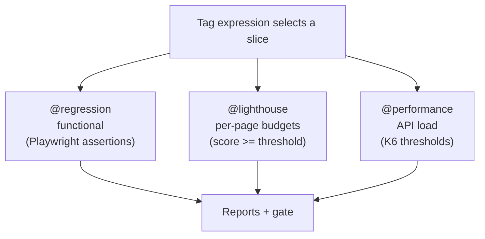
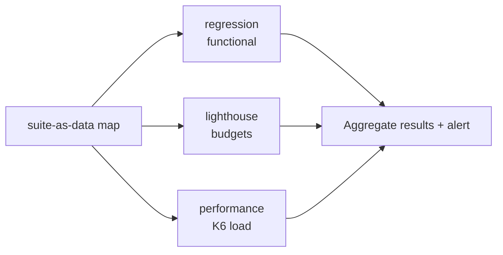

# Quality Gates Beyond Functional: Lighthouse and K6 in One Tag‑Driven Pipeline

> Functional tests tell you the feature works. They say nothing about whether the page is *fast enough* or the API *holds up under load*. Here's how performance and budget checks become first‑class, tagged, gated members of the same suite — not separate tools nobody runs.

A suite can be 3,000 functional tests deep and still ship a homepage that takes eight seconds to paint, or an API that falls over at 10 requests a second. Functional correctness and *non‑functional* quality are different axes, and most teams test only the first because the second lives in separate tools with separate runners that drift into disuse.

This article is about pulling two non‑functional gates — **Lighthouse** (page‑level performance, accessibility, SEO, best‑practices budgets) and **K6** (API load and throughput) — into the same model as everything else: tagged for selection, thresholds as assertions, reports as artifacts, failures that break the build. Low sensitivity; the patterns are generic.

---

## One pipeline, three kinds of gate

The goal is a single mental model where functional, performance‑budget, and load checks are *the same kind of thing* — a tagged slice with a pass/fail gate — even though the engines underneath differ.



The unifying idea: **a threshold is just an assertion.** A Lighthouse performance score below 0.90 should fail a test the same way a missing button does. A K6 p95 latency over budget should fail a run the same way a 500 does.

---

## Lighthouse: page budgets as assertions

Lighthouse runs a real audit against a URL and returns category scores (performance, accessibility, best‑practices, SEO). On its own that's a report. To make it a *gate*, you compare each score against a configured threshold and assert.

**Thresholds live as data**, per device, with sensible shared defaults:

```js
const defaultThresholds = {
  performance:     0.90,
  accessibility:   0.90,
  'best-practices':0.90,
  seo:             0.90,
};

export const thresholds = {
  desktop: { ...defaultThresholds },
  mobile:  { ...defaultThresholds /* override per device if needed */ },
};
```

**The device profiles also live as data** — throttling, form factor, screen emulation — so a "mobile" run faithfully simulates a constrained device instead of a developer's gigabit laptop:

```js
export const lighthouseConfig = {
  mobile: {
    extends: 'lighthouse:default',
    settings: {
      formFactor: 'mobile',
      throttlingMethod: 'simulate',
      throttling: { /* FAST_4G-like profile */ },
      screenEmulation: { mobile: true, width: 360, height: 640, deviceScaleFactor: 2 },
    },
  },
  desktop: { extends: 'lighthouse:default', settings: { formFactor: 'desktop', /* ... */ } },
};
```

**The step ties it together**: run the audit, attach the HTML report, then assert every category against its budget.

```js
Given('Run lighthouse tests {string}, {string}', async ({ brand, $testInfo }, functionality, device) => {
  const url = `${process.env[`${brand}_URL`]}${pathFor(functionality)}`;

  const result = await runLighthouseTest(url, functionality, device);

  // Artifact: the full HTML report, attached to the run for humans
  const reportPath = await saveReport(brand, functionality, device, result.report);
  attachFileToReport($testInfo, reportPath, 'text/html', 'lighthouse report');

  // Gate: every category score must meet its budget, or the test fails
  validateScores(result, thresholds[device]);
});

function validateScores(result, budget) {
  const c = result.lhr.categories;
  expect(c.performance.score).toBeGreaterThanOrEqual(budget.performance);
  expect(c.accessibility.score).toBeGreaterThanOrEqual(budget.accessibility);
  expect(c['best-practices'].score).toBeGreaterThanOrEqual(budget['best-practices']);
  expect(c.seo.score).toBeGreaterThanOrEqual(budget.seo);
}
```

Now a performance regression on a key page fails CI like any other test — with the full Lighthouse report attached so you can see *why*.

> Keep budgets in data, not in the step. When a page legitimately needs a different bar, you edit a config object, not test logic — and the override is visible and reviewable.

---

## K6: load thresholds as the pass/fail contract

K6 answers a question Playwright can't: *does the API hold up when hammered?* It runs outside the browser, generating concurrent traffic, and — crucially — has a built‑in **thresholds** concept that is itself the gate. If a threshold is breached, K6 exits non‑zero, which fails the pipeline.

**Scenarios as data**, mirroring the suite‑as‑data philosophy — smoke, load, stress, spike — each a named load profile:

```js
const defaultConfig = {
  thresholds: {
    http_req_duration: ['p(75)<800', 'p(95)<1200', 'p(99)<1500'],  // latency budget
    http_req_failed:   ['rate<0.05'],                               // error budget
    http_reqs:         ['count>0'],                                 // sanity: we actually sent traffic
  },
};

export const configurations = {
  smoke:  createConfig({ /* 1 TPS for 30s — does the test even work? */ }),
  load:   createConfig({ /* 3 TPS for 3m — normal expected load */ }),
  stress: createConfig({ /* 5 TPS for 5m — above normal */ }),
  spike:  createConfig({ /* 1→10→1 TPS — sudden surge */ }),
};
```

**The runner picks scenario and environment from env vars** — the same run‑contract pattern the functional containers use, so the *same script* runs locally and in CI against any environment:

```js
const environment = __ENV.ENVIRONMENT || 'local';
const scenario    = __ENV.SCENARIO    || 'smoke';

export const options = {
  ...configurations[scenario],
  thresholds: { ...configurations[scenario].thresholds },
};

export default function () {
  const res = http.post(`${environments[environment]}/endpoint`, payload);
  check(res, { 'status is 2xx': (r) => r.status >= 200 && r.status < 300 });
}
```

```bash
# Selecting a load profile is just two env vars — the gate is built in
k6 run -e ENVIRONMENT=preprod -e SCENARIO=load \
       runners/api-runner.js \
       --out json=performance-reports/results.json
```

Because the thresholds *are* the exit code, you don't write separate assertions — a breached latency or error budget fails the run by itself.

---

## Bonus: load tests that catch concurrency bugs

K6's concurrency is good for more than throughput numbers — it reproduces **race conditions** functional tests can't. Fire several simultaneous requests that *should* be mutually exclusive (e.g. only one can succeed) and assert the business invariant holds under contention:

```js
// Send N concurrent requests for the same entity; exactly one should win.
// A functional test sends them one at a time and never sees the race.
const responses = http.batch(concurrentRequests);
const approved = responses.filter((r) => r.json('status') === 'APPROVED').length;
check(null, { 'exactly one approved under contention': () => approved === 1 });
```

This is load tooling doing *correctness* work — the kind of bug that only appears when two requests arrive in the same millisecond.

---

## Folding both into the tag‑driven model

Neither tool needs a bespoke pipeline. Each becomes a tagged suite in the same suite‑as‑data map that provisions every other slice:

```js
const testSuites = {
  lighthouse:  { tags: "@lighthouse",   workers: 4,  cpu: 4, memory: 8192 },
  performance: { tags: "@performance",  workers: 1,  cpu: 4, memory: 8192 }, // K6 manages its own concurrency
  regression:  { tags: "@regression",   workers: 12, cpu: 8, memory: 16384 },
};
```

The orchestrator runs them in the right order, archives their reports to the same object store, and alerts on failure through the same channel. Performance and load stop being "that thing we run before a big release" and become continuous gates.



---

## Lessons learned

- **A threshold is just an assertion.** A Lighthouse score below budget or a K6 latency over budget should fail the build exactly like a broken button does.
- **Keep budgets and load profiles as data.** Per‑device thresholds and named scenarios (smoke/load/stress/spike) make the bar visible, reviewable, and easy to tune without touching test logic.
- **Simulate the constrained device.** A "mobile" Lighthouse run with real throttling catches regressions a developer's fast machine hides.
- **Let K6 thresholds be the gate.** Because a breached threshold exits non‑zero, the load contract enforces itself — no separate assertions needed.
- **Use load for correctness, not just speed.** Concurrent, mutually‑exclusive requests reproduce race conditions that sequential functional tests structurally cannot see.
- **Reuse the tag pipeline for both.** `@lighthouse` and `@performance` plug into the same selection, ordering, reporting, and alerting machinery — no parallel infrastructure to rot.

Functional tests prove the software *does the right thing*. Lighthouse and K6, folded into the same tag‑driven pipeline, prove it does so *fast enough* and *under enough load* — and because they're gated and continuous, those properties stop quietly regressing between releases.

---

*Written from real‑world experience building a large, multi‑environment Playwright suite. All URLs, thresholds, scenarios, and examples are generic illustrations of the patterns described.*
