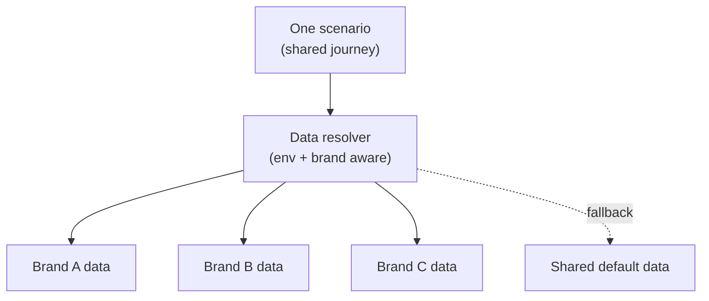
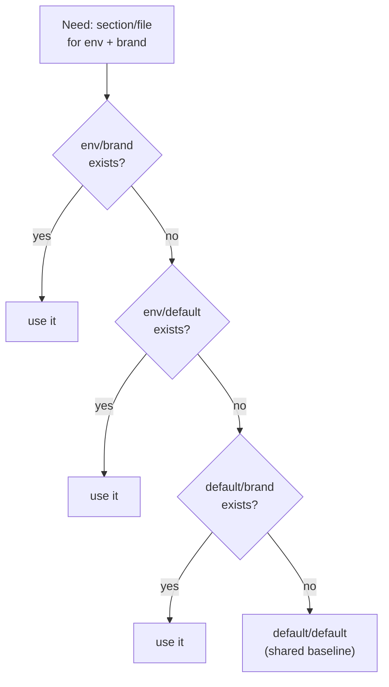

# One Suite, Many Brands: A White‑Label / Multi‑Tenant Testing Strategy

> When the same product ships under several brands, the naive answers are "copy the suite per brand" or "test only one and hope." Both are wrong. Here's how a single suite covers many tenants through shared journeys, a layered data‑resolution fallback, and per‑tenant overrides.

A white‑label product is one codebase wearing many faces: same loan journey, same checkout, same account flow — different logo, colours, copy, URLs, and a handful of genuinely different business rules per brand. Testing it is a trap. Duplicate the suite per brand and every fix becomes N fixes and the copies drift. Test one brand and the others ship untested. Parameterise badly and you get a tangle of `if (brand === 'x')` that nobody can read.

This article is about the middle path that scales: **one set of journeys, executed per tenant, with data resolved through a fallback hierarchy** so brands share everything by default and override only what genuinely differs. The example brands and values here are invented.

---

## The principle: share the journey, vary the data

The insight that makes multi‑tenant testing tractable: for a white‑label product, the *journey* is almost always identical across brands — it's the **data** that varies. So you write the scenario once and let each brand supply its own data through a resolver, falling back to shared defaults for everything it doesn't override.



You are not maintaining N suites. You are maintaining one suite and N (small) data overlays.

---

## Layer 1 — Brand as a tag dimension

In a tag‑driven suite, the brand is just another orthogonal tag family. A scenario outline lists the shared steps once, then attaches brand‑specific example tables — each tagged with its brand:

```gherkin
Feature: accessibility tests for application pages

  Scenario Outline: a11y scan — brand: <brand>, page: "<pageName>"
    Given I access the application start page
    Given Run accessibility tests pageName:"<pageName>" device: "<device>"

    @brand-a
    Examples:
      | brand   | pageName          | device  |
      | BRAND_A | application-start | desktop |

    @brand-b
    Examples:
      | brand   | pageName          | device  |
      | BRAND_B | application-start | desktop |
```

The journey steps are written **once**. Each brand contributes a row, tagged so you can run one brand, a subset, or all:

```bash
# All brands
npx bddgen --tags "@accessibility and @preprod"
# Just one brand while debugging
npx bddgen --tags "@accessibility and @brand-a and @preprod"
```

The `brand` value flows into the steps as a fixture, where it becomes the key for resolving everything brand‑specific — URLs, data, expectations.

---

## Layer 2 — The 4‑level data‑resolution fallback

This is the engine of the whole strategy. Every piece of test data is resolved through a hierarchy that tries the **most specific** location first and falls back to **shared defaults**. The two axes that vary are *environment* and *brand*, giving four candidates in priority order:

```js
async function resolveTestDataPath(section, env, brand, fileName) {
  brand = (brand || 'default').toLowerCase();
  env   = (env   || 'default').toLowerCase();

  const candidates = [
    `tests/test-data/${section}/${env}/${brand}/${fileName}`,   // 1. exact: this env, this brand
    `tests/test-data/${section}/${env}/default/${fileName}`,    // 2. this env, any brand
    `tests/test-data/${section}/default/${brand}/${fileName}`,  // 3. any env, this brand
    `tests/test-data/${section}/default/default/${fileName}`,   // 4. shared baseline
  ];

  for (const candidate of candidates) {
    if (await fs.pathExists(candidate)) return candidate;
  }
  throw new Error(`Test data not found. Tried:\n${candidates.join('\n')}`);
}
```

Read that priority list as a sentence: *"Use this brand's data for this environment if it exists; otherwise this environment's shared data; otherwise this brand's cross‑environment data; otherwise the shared baseline."*



The power of this is **inheritance by default**. A new brand starts with *zero* data files — it inherits the shared baseline for everything. You add an override file only for the specific thing that actually differs for that brand. The directory tree becomes a precise map of "what's truly brand‑specific" versus "what's shared," because shared data simply isn't duplicated.

---

## Layer 3 — Per‑tenant config that isn't data files

Some brand variation isn't a JSON fixture — it's a URL, a secret, a feature flag. Resolve those by brand‑keyed environment variables, so the same step targets the right tenant without branching:

```js
// One line resolves the right host for whichever brand the scenario is running
const urlHost = process.env[`${brand}_URL`];        // BRAND_A_URL, BRAND_B_URL, ...
const url = `${urlHost}${pathFor(functionality)}`;
```

Brand‑scoped artifacts (sessions, reports, caches) follow the same discipline — the brand is part of the key, so tenants never collide:

```js
function storageFilePath(env, brand, userId) {
  return path.join(base, `${env}-${brand.toLowerCase()}-${userId}-storageState.json`);
}
// desktop-preprod-brand_a-checkout.json, etc.
```

The rule: **brand is a coordinate, never a branch.** You key on it — in a path, an env‑var name, a filename — rather than writing `if (brand === ...)`.

---

## Layer 4 — When business rules genuinely differ

Sometimes a brand really does behave differently — a different decline reason, an extra step, a different product. The disciplined way to express that is *still data*, not control flow. Carry the brand‑specific expectation in the example table or a brand‑resolved expectation file, so the journey stays single:

```gherkin
    @brand-a
    Examples:
      | brand   | decision | expectedOutcome              |
      | BRAND_A | decline  | tc_decline_no_offers         |

    @brand-b
    Examples:
      | brand   | decision | expectedOutcome              |
      | BRAND_B | decline  | tc_decline_alternative_offer |
```

The step reads `expectedOutcome` and asserts against the brand's resolved expectation file. The *behaviour* differs; the *test code* doesn't. When you genuinely can't avoid a branch (a brand has an extra screen), isolate it behind a brand‑resolved page object or a tagged sub‑scenario — never an inline conditional scattered through a shared step.

---

## The sensitivity caveat — genericise hard

White‑label testing is the highest‑sensitivity topic in this series, because brand names, URLs, and divergent business rules *are* the product's commercial structure. If you write about this pattern publicly, strip it to the mechanism:

- Use placeholder brands (`BRAND_A`, `BRAND_B`) — never real ones.
- Use `*_URL` env‑var *shapes*, never real hosts or the count of real brands.
- Show the *fallback mechanism* and the *"brand is a coordinate"* rule — not the actual matrix of which brand overrides what, which can reveal real business differences.

The pattern is genuinely reusable; the specific overlay for a real product is not shareable. Keep the article at the level of the resolver and the directory convention.

---

## Lessons learned

- **Share the journey, vary the data.** For a white‑label product the flow is the same across brands — write it once and let a resolver supply per‑brand data.
- **Make fallback the default.** A most‑specific‑to‑shared resolution hierarchy means a new brand inherits everything and overrides only what truly differs; shared data is never duplicated.
- **Brand is a coordinate, not a branch.** Key on the brand in paths, env‑var names, and filenames — `process.env[`${brand}_URL`]`, `env-brand-user.json` — instead of `if (brand === ...)`.
- **Keep brand artifacts brand‑scoped.** Putting the brand in every cache/report/session key stops tenants from colliding in shared runs.
- **Express divergent rules as data, isolate real branches.** Carry differing expectations in example tables or brand‑resolved files; when a real code branch is unavoidable, hide it behind a brand‑resolved page object, never an inline conditional.
- **Genericise hard before publishing.** Brand names, URLs, and the override matrix are commercial structure — share the mechanism, not the matrix.

The trap of multi‑tenant testing is choosing between duplication and under‑coverage. The escape is to stop thinking in suites and start thinking in *one suite plus thin per‑tenant overlays*: shared journeys, a fallback resolver, and brand as a coordinate. One thing to maintain, N brands covered, and a directory tree that tells you exactly what's actually different.

---

*Written from real‑world experience building a large, multi‑environment Playwright suite. All brand names, URLs, business rules, and examples are invented, generic illustrations of the patterns described.*
