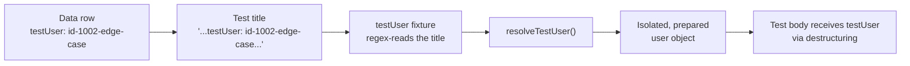
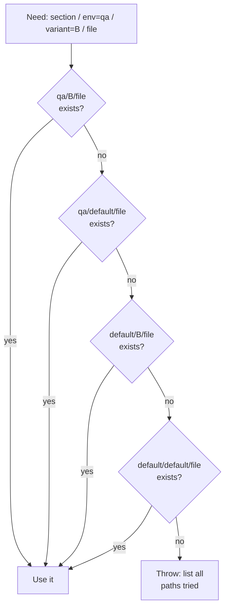
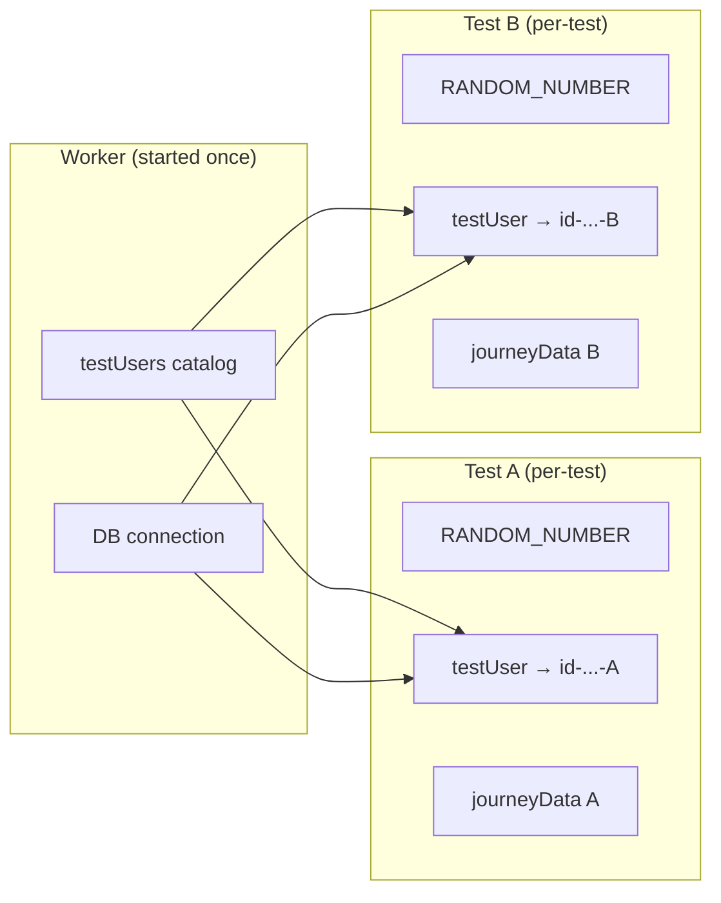

# Highly Scalable Test Data Management in Playwright

> How we tie thousands of test users and hundreds of journey datasets to the right test — automatically — using fixtures, not glue code.

Test logic is rarely what kills a large automation suite. **Test data is.** Once you pass a few hundred scenarios, the data layer becomes the thing that rots: hard‑coded users copy‑pasted across files, parallel tests colliding on the same record, environment‑specific values smuggled into `if` branches, and a "test data" folder nobody dares to refactor.

This article is about the data architecture that lets a single Playwright suite manage **thousands of test users and hundreds of journey datasets** without any of that pain. The central idea is simple and worth saying up front:

> A test should *declare* the data it needs. The framework should *find, prepare, and clean up* that data automatically.

No `beforeEach` wiring. No manual lookups. No data plumbing inside test bodies. We get there with [Playwright fixtures](https://playwright.dev/docs/test-fixtures) and one elegant binding trick.

---

## The problem with "just import the data"

The naive approach imports a JSON blob into a test:

```js
import users from "../data/users.json";

test("user can sign in", async ({ page }) => {
  await signIn(page, users.standardUser); // hard-coded choice
});
```

This breaks in every direction at scale:

- The test is welded to **one** user — you can't reuse it for the premium user, the locked‑out user, or the edge‑case user.
- Every spec loads **all** the data, even data it never touches.
- The same record is shared by every parallel worker, so two tests racing on the same user corrupt each other.
- Environment differences (`local` vs `qa` vs `prod`) leak into the test as branching.

What we want instead is for the *test* to say which user it needs, and for the *framework* to deliver exactly that — isolated, prepared, and torn down.

---

## The core idea: the test title is the data contract

Data‑driven tests in Playwright are typically generated in a loop, one `test()` per data row. We make the **title of each generated test carry its data identifiers**, then a fixture reads them back out of `testInfo.title`. The test body stays completely generic; the title decides which data flows in.

```js
const cases = [
  { testUser: "id-1001-standard",  journeyData: "journey-standard-happy" },
  { testUser: "id-1002-edge-case", journeyData: "journey-edge-rejection" },
];

for (const c of cases) {
  test(
    `User completes the signup journey. testUser: "${c.testUser}", journeyData: "${c.journeyData}"`,
    async ({ page, testUser, journeyData }) => {
      await startJourney(page);
      await fillForm(page, testUser, journeyData); // generic body
      await expectConfirmation(page);
    }
  );
}
```

The fixtures do the binding by reading the identifiers straight out of the title:

```js
testUser: async ({ testUsers, RANDOM_NUMBER }, use, testInfo) => {
  // Read the identifier straight out of the test title
  const match = testInfo.title.match(/testUser: "(.*?)"/);
  const uniqueName = match ? match[1] : null;

  // Resolve it to a fully-prepared, isolated user object
  const testUser = await testUsers.resolveTestUser(uniqueName, RANDOM_NUMBER);
  await use(testUser);
},

journeyData: async ({ env }, use, testInfo) => {
  const match = testInfo.title.match(/journeyData: "(.*?)"/);
  const fileName = match ? match[1] : null;
  const data = await fs.readJson(
    await resolveTestDataPath("journey", env, "default", `${fileName}.json`)
  );
  await use(data);
},
```

The test body simply asks for `testUser` or `journeyData` by name — it never knows or cares *which* user or dataset arrived. The same body serves every data row. Add a new data scenario by adding an **entry to the array**, not code.



This single pattern is what makes the suite scale: **data selection is declarative and lives next to the test list; data resolution is centralized in one fixture.**

---

## Layer 1 — A catalog of static users, addressed by intent

Thousands of users are kept in a catalog where each entry is identified by a **purpose‑describing unique name**, not by anonymous index:

```json
[
  { "id": 1001, "uniqueName": "id-1001-standard",    "purpose": "happy-path" },
  { "id": 1002, "uniqueName": "id-1002-edge-case",   "purpose": "rejection-flow" },
  { "id": 1003, "uniqueName": "id-1003-locked-out",  "purpose": "auth-failure" }
]
```

The `uniqueName` is the key the test references. It reads like documentation (`id-1003-locked-out`), and the numeric `id` keeps it collision‑free even when names are similar. A small loader class indexes the catalog so lookups by name or id are O(1):

```js
class TestUsers {
  async loadTestUsersData(env) {
    this.testUsers = await fs.readJson(
      await resolveTestDataPath("test-users", env, "default", "test-users.json")
    );
  }
  getTestUserByUniqueName(name) {
    return this.testUsers.find((u) => u.uniqueName === name);
  }
}
```

Crucially, the catalog is loaded **once per worker** through a fixture, and individual users are handed out per test. Tests never read files directly.

---

## Layer 2 — Generated users for infinite, collision‑free scale

A static catalog can't cover everything. Many tests need a *fresh, unique* user every run — especially registration and "new account" flows where re‑using a record would fail on the second execution. Rather than hand‑authoring thousands of throwaway users, we **generate** them on demand.

The resolver branches on a naming convention. Ask for any name containing `-any-user` and you get a freshly fabricated person:

```js
async resolveTestUser(uniqueName, RANDOM_NUMBER) {
  if (uniqueName?.includes("-any-user")) {
    const generated = this.generateRandomTestUser(uniqueName, RANDOM_NUMBER);

    // Optional: merge explicit overrides from the catalog on top of the
    // random base — e.g. force a specific firstName to trigger an edge case.
    const overrides = this.getTestUserByUniqueName(uniqueName);
    if (overrides) {
      const RESERVED = ["id", "uniqueName", "purpose", "comment"];
      for (const [k, v] of Object.entries(overrides)) {
        if (!RESERVED.includes(k)) generated[k] = v;
      }
    }
    return generated;
  }
  // Otherwise return the static catalog user
  return this.getTestUserByUniqueName(uniqueName);
}
```

Generation uses a faker‑style helper for realistic names, dates, and addresses, and stamps a per‑test `RANDOM_NUMBER` into the unique fields:

```js
generateRandomTestUser(uniqueName, RANDOM_NUMBER) {
  const person = this.getRandomPerson();
  return {
    id: RANDOM_NUMBER,
    uniqueName: `id-${RANDOM_NUMBER}-${uniqueName}`,
    firstName: person.firstName,
    surName: person.lastName,
    dateOfBirth: person.dateOfBirth,
    mobileNumber: `070000${RANDOM_NUMBER}`,        // unique per test
    email: `test-user-${RANDOM_NUMBER}@example.test`, // unique per test
  };
}
```

This is the trick that makes **parallel execution safe**. Because `RANDOM_NUMBER` is itself a per‑test fixture, every worker gets users whose contact details can never collide — no shared mutable record, no flaky "user already exists" failures.

The "generate base + apply catalog overrides" combo gives the best of both worlds: infinite uniqueness *and* the ability to pin one field when a test needs a specific edge condition.

---

## Layer 3 — Template placeholders for unique‑but‑structured data

Journey datasets (hundreds of JSON files describing multi‑step flows) often embed fields that must be unique per run but otherwise structured. We keep them as **templates with placeholders** and substitute at resolve time:

```json
{
  "accountName": "Account-__REPLACE_WITH_RANDOM_STRING__",
  "reference":   "REF-__REPLACE_WITH_RANDOM_NUMBER__"
}
```

A generic `replaceInObject` walks the loaded object and swaps tokens for the per‑test random values:

```js
productData: async ({ env, RANDOM_STRING }, use, testInfo) => {
  const fileName = testInfo.title.match(/productData: "(.*?)"/)?.[1];
  const data = await fs.readJson(
    await resolveTestDataPath("product", env, "default", `${fileName}.json`)
  );
  replaceInObject(data, { RANDOM_STRING }); // unique account name every run
  await use(data);
},
```

The dataset author writes intent‑revealing JSON; the framework guarantees uniqueness. No author ever has to remember to "make this unique."

---

## Layer 4 — A 4‑level fallback resolver for environments and variants

The biggest source of data sprawl is duplication across environments and product variants. The wrong fix is to copy every dataset into every environment folder. Our fix is a **specificity cascade**: ask for the most specific file, fall back toward a shared baseline.

```js
async function resolveTestDataPath(section, env, variant, fileName) {
  const candidates = [
    `tests/test-data/${section}/${env}/${variant}/${fileName}`,   // most specific
    `tests/test-data/${section}/${env}/default/${fileName}`,      // env-specific
    `tests/test-data/${section}/default/${variant}/${fileName}`,  // variant-specific
    `tests/test-data/${section}/default/default/${fileName}`,     // shared baseline
  ];
  for (const candidate of candidates) {
    if (await fs.pathExists(candidate)) return candidate;
  }
  throw new Error(`Test data not found. Tried:\n${candidates.join("\n")}`);
}
```



The payoff: **write a dataset once at the baseline, override only the deltas.** A value that differs only on `qa` lives in exactly one `qa/default` file; everything else inherits from `default/default`. When a test fails to find data, the error lists every path it tried — debugging a missing file takes seconds, not guesswork.

---

## Tying it together: lazy, isolated, self‑cleaning

Each layer is exposed as a fixture, and fixtures give us three properties that are essential at scale:

**Lazy** — data is only loaded if a test actually requests that fixture. A test that never touches journey data never opens a journey file.

**Cached per test, shared per worker where it counts** — the expensive things (catalog loading, DB connections) are `worker`‑scoped and created once per worker; the per‑test things (the chosen user, the journey object) are fresh each test:

```js
// Loaded once per worker, reused across that worker's tests
testUsers: async ({ env }, use) => {
  const users = new TestUsers();
  await users.loadTestUsersData(env);
  await use(users);
},

// Expensive connection, shared across the worker's tests, closed at the end
dbConnection: [async ({}, use) => {
  const db = new DbConnection();
  await db.connect();
  await use(db);
  await db.close();          // teardown
}, { scope: "worker" }],
```

**Self‑cleaning** — anything after `use()` runs as teardown, in reverse order, pass or fail. Seeded records get removed; connections get closed; shared state gets restored. No orphaned data accumulating across runs.



---

## Lessons learned

A few principles that have held up across thousands of tests:

- **Make the test declare its data.** Putting the data identifier in the test title — and reading it back from `testInfo.title` in a fixture — decouples test logic from data choice completely. One test body, unlimited data variations.
- **Address data by intent, not index.** `id-1003-locked-out` is self‑documenting; `users[2]` is a future bug.
- **Generate for uniqueness, catalog for specificity.** Fresh generated users keep parallel runs collision‑free; a static catalog (and overrides) pins the exact edge cases you need.
- **Template the volatile fields.** Placeholders plus a per‑test random value mean dataset authors never have to think about uniqueness.
- **Cascade, don't copy.** A specificity‑ordered resolver kills duplication across environments and variants, and its "paths I tried" error message makes missing data trivial to debug.
- **Let fixtures own the lifecycle.** Lazy creation, worker‑scoped reuse for expensive resources, and guaranteed teardown are what keep a giant data layer from leaking.

The result is a data layer that *feels* small even though it manages thousands of users and hundreds of datasets. Adding coverage is usually a one‑line change to a data array — and the framework quietly does the rest: find the data, make it unique, hand it to the test, and clean up afterward.

---

*Written from real‑world experience building a large, multi‑environment Playwright suite. All names, values, and examples are generic illustrations of the patterns described.*
