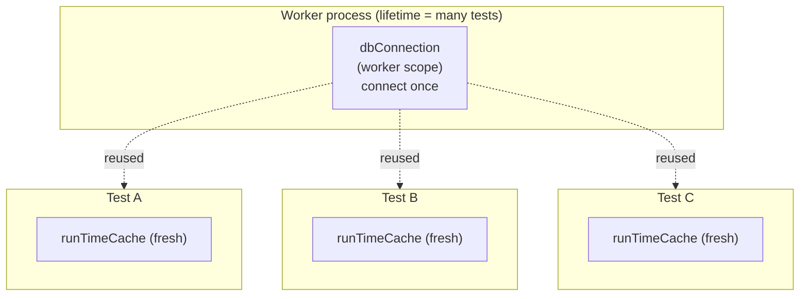
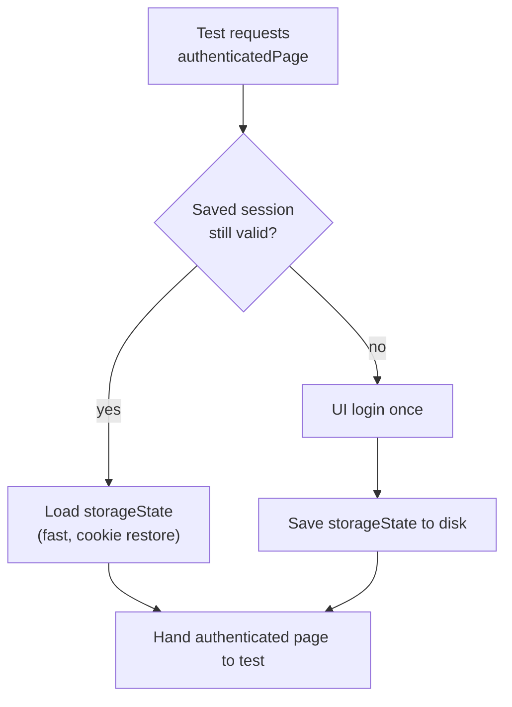

# Playwright Fixtures as a Runtime System: Five Patterns Beyond `page`

> Scopes, teardown‑only guards, cached sessions, and self‑built browser contexts — the fixture mechanics that quietly run a 3,000‑test suite.

Most Playwright tutorials introduce fixtures as "that thing that gives you `page`," show a one‑off custom fixture, and move on. That undersells them badly. Fixtures are a full **dependency‑injection and lifecycle runtime** — and once a suite gets large, that runtime is what keeps it from collapsing under its own setup/teardown weight.

This is a deep‑dive into fixture *mechanics*, not "what is a fixture." If you want the basics — composition with `base.extend`, splitting fixtures by domain — that's a different conversation. Here we go straight to the five patterns that do the heavy lifting in a real, large suite:

1. **Scope** — per‑test vs per‑worker, and why it changes everything for shared resources.
2. **Teardown‑only "guard" fixtures** — restore global state no matter how a test ends.
3. **Cached‑session fixtures** — log in once, reuse the authenticated state everywhere.
4. **Self‑built browser contexts** — when the default `page` isn't enough.
5. **`testInfo`‑aware fixtures** — fixtures that read the test's own metadata.

---

## The mental model: a fixture is a slice of setup + teardown around your test

Every fixture is a function split by a single `await use(value)` call. Everything before `use` is **setup**, everything after is **teardown**, and the value handed to `use` is what the test (or another fixture) receives.

```js
myThing: async ({ dependency }, use) => {
  const thing = await create(dependency); // setup
  await use(thing);                        // test runs here
  await thing.dispose();                   // teardown — always runs
}
```

The runtime guarantees three things that `beforeEach`/`afterEach` never did cleanly:

- **Lazy** — the fixture only runs if something actually requests it.
- **Ordered** — fixtures set up in dependency order and tear down in reverse.
- **Resilient** — teardown runs whether the test passed, failed, or threw.

Hold that model; every pattern below is a variation on it.

---

## Pattern 1 — Scope: per‑test isolation vs per‑worker reuse

By default a fixture is **test‑scoped**: created fresh for every test, destroyed after. That's exactly what you want for isolation — a fresh user object, a clean cache, an independent `page`.

But some resources are *expensive* and *safe to share*: a database connection, a message‑queue client, an auth token for a service account. Recreating them per test would dominate your runtime. Mark those `{ scope: "worker" }` and Playwright creates them **once per worker process** and reuses them across every test that worker runs:

```js
// Created ONCE per worker, reused by all its tests, closed at the very end
dbConnection: [async ({}, use) => {
  const db = new DbConnection();
  await db.connect();
  await use(db);
  await db.close();        // teardown runs when the worker finishes
}, { scope: "worker" }],

// Created fresh for EVERY test — isolation matters here
runTimeCache: async ({}, use) => {
  await use(new RunTimeCache());
},
```

This is connection pooling without a pooling library. With, say, three workers you hold three connections total — not one per test across thousands of tests.



> Rule of thumb: **test‑scope by default; worker‑scope only for expensive, stateless‑between‑tests resources.** A worker‑scoped fixture that holds mutable per‑test state is a cross‑test contamination bug waiting to happen.

---

## Pattern 2 — Teardown‑only "guard" fixtures

This is the most under‑used fixture trick, and it solves a real problem: **some tests mutate global state** — a feature flag, the system clock, a shared availability setting — and that state *must* be restored afterward, even if the test fails halfway through.

A `try/finally` in the test body is fragile (easy to forget, easy to bypass with an early return). Instead, encode the restoration as a fixture whose *only* job is teardown. The setup half does nothing; the teardown half does the cleanup:

```js
restoreSystemClock: async ({}, use) => {
  await use(new DoNothing());   // setup: hand back a no-op placeholder
  await resetSystemClock();     // teardown: ALWAYS runs after the test
},

restoreSharedAvailability: async ({ dbConnection, env }, use) => {
  await use(new DoNothing());        // setup: nothing
  await restoreAvailability(dbConnection, env); // teardown: guaranteed
},
```

`DoNothing` is exactly what it sounds like:

```js
class DoNothing { constructor() {} }
```

A test opts into the guarantee simply by **listing the fixture** — it never has to call anything:

```js
test("flow that shifts the system clock", async ({ page, restoreSystemClock }) => {
  await advanceClockByOneMonth();
  await runTimeSensitiveFlow(page);
  // no cleanup code here — the guard fixture restores the clock on teardown,
  // pass or fail
});
```

The value (`new DoNothing()`) is irrelevant; requesting the fixture is what *registers the teardown*. Because Playwright runs fixture teardown in reverse order regardless of outcome, your global state is restored deterministically. This turns "remember to undo your mess" from a code‑review checklist item into a structural guarantee.

---

## Pattern 3 — Cached‑session fixtures (log in once, reuse everywhere)

Authentication is the classic per‑test tax. Logging in through the UI for every one of thousands of tests is slow and pointless. The fix is a fixture that **persists `storageState` to disk on first login and reloads it thereafter** — collapsing most logins into a cookie restore.

```js
authenticatedPage: async ({ page, env, testUser }, use) => {
  const key = testUser.uniqueName;

  if (await isStorageStateValid(env, key)) {
    // Fast path: reuse a previously saved session
    await loadStorageStateToPage(page, env, key);
  } else {
    // Slow path: log in via the UI, then save the session for next time
    await performUserLogin({ page, testUser });
    await saveStorageState(page, env, key);
  }

  await use(page); // test receives an already-authenticated page
}
```

The first test for a given user pays the login cost; every subsequent test (this run or the next) restores cookies in milliseconds. The fixture hides the entire branch — the test just asks for `authenticatedPage` and starts doing work.



> Keying the cache by a stable `uniqueName` means each distinct user gets its own reusable session, and sessions survive across runs — so your *second* CI run is even faster than your first.

---

## Pattern 4 — Building your own browser context inside a fixture

Sometimes the default `page` doesn't fit. A back‑office tool might demand a desktop‑only user agent, a fixed viewport, or — critically — a **fully isolated context** because the application shares a single server‑side session per context and you need independent sessions in parallel.

A fixture can launch its own browser, build a bespoke context, and clean it all up on teardown:

```js
isolatedDesktopPage: async ({ headless }, use) => {
  const { chromium } = require("playwright");
  const browser = await chromium.launch({ headless });

  const context = await browser.newContext({
    viewport: { width: 1366, height: 768 }, // force desktop layout
    userAgent: "Desktop-Agent-Browser",     // app refuses mobile UAs
  });

  const page = await context.newPage();
  await use(page);

  await browser.close(); // teardown closes browser + context together
}
```

This is the escape hatch from project‑level config. The Playwright config's device/viewport settings apply to the default `page`; when one slice of your suite needs different rules, you don't fork the config — you express the requirement *locally* in a fixture, and teardown guarantees the extra browser is always closed. Combine it with Pattern 3 and you get isolated, pre‑authenticated desktop contexts on demand.

---

## Pattern 5 — Fixtures that read `testInfo`

Fixtures receive a third argument, `testInfo`, giving them access to the running test's own metadata — its title, annotations, project, retry count, and more. That lets a fixture **derive its value from the test itself**, with zero per‑test wiring.

```js
// Pull an identifier out of the test's title and resolve it
adminUser: async ({ testUsers }, use, testInfo) => {
  const uniqueName = testInfo.title.match(/adminUser: "(.*?)"/)?.[1];
  await use(testUsers.getByUniqueName(uniqueName));
},

// Adjust behaviour based on runtime context
verboseArtifacts: async ({}, use, testInfo) => {
  const isRetry = testInfo.retry > 0;
  await use({ trace: isRetry, screenshots: isRetry });
},
```

This is what makes data‑driven suites feel effortless: the *test* declares what it wants in its title or annotations, and the *fixture* reads it back and produces the right object. No parameter threading, no lookup tables in the test body — the fixture is the single point that maps "what the test said it needs" to "the prepared thing."

---

## How the patterns compose

The real power shows up when these stack. A single test can pull:

- a **worker‑scoped** DB connection (Pattern 1),
- a **`testInfo`‑derived** user (Pattern 5),
- an **isolated desktop context** for that user (Pattern 4),
- already **authenticated** via cached `storageState` (Pattern 3),
- with a **guard fixture** that restores any global state it touches (Pattern 2):

```js
test('back-office reviewer can action a record. adminUser: "id-501-reviewer"',
  async ({ dbConnection, authenticatedDesktopPage, restoreSharedAvailability }) => {
    // dbConnection: reused across the worker
    // authenticatedDesktopPage: isolated context, pre-logged-in
    // restoreSharedAvailability: cleanup is already guaranteed
    await doTheActualTest(authenticatedDesktopPage, dbConnection);
  }
);
```

The test body is three lines of *intent*. Every expensive setup, every cleanup, every isolation guarantee lives in the fixture layer — declared once, reused everywhere, and torn down automatically.

---

## Lessons learned

- **Scope is a performance lever, not a detail.** Worker‑scope the expensive shared resources; test‑scope everything that carries state. Getting this wrong is either slow (over‑isolated) or flaky (over‑shared).
- **Encode cleanup as a teardown‑only fixture.** A no‑op value plus post‑`use` restoration turns "don't forget to undo this" into a structural guarantee that survives failures and early returns.
- **Cache authentication on disk.** Keying `storageState` by a stable identifier collapses thousands of logins into cookie restores and makes repeat runs faster.
- **A fixture can build its own browser.** When the default `page` doesn't fit, express the requirement locally and let teardown close what you opened.
- **Let fixtures read `testInfo`.** Deriving values from the test's own metadata removes per‑test wiring entirely.

Treat fixtures as the runtime system they are — with scopes, lifecycles, and teardown guarantees — and test setup stops being boilerplate you copy around. It becomes a small, composable layer the whole suite quietly stands on.

---

*Written from real‑world experience building a large, multi‑environment Playwright suite. All names, values, and examples are generic illustrations of the patterns described.*
