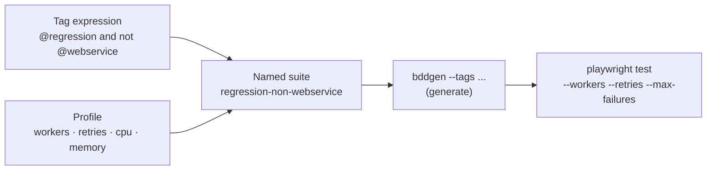
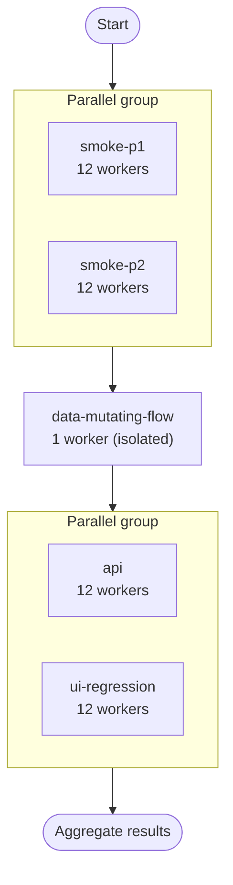

# Tag‑Driven Test Execution: Turning 3,000 Playwright Tests Into a Schedulable Pipeline

> How a small tag vocabulary and a "suite‑as‑data" model let us slice thousands of tests into precisely‑tuned, parallelisable batches.

When a Playwright suite is small, "run the tests" means `npx playwright test`. When it crosses a few thousand, that command becomes useless: it's too slow to gate a pull request, too coarse to debug a single area, and too blunt to tune for cost. You stop thinking about *the suite* and start thinking about **which slice, with how much parallelism, in what order**.

This article is about the execution model that makes that tractable: a layered **tag taxonomy** as the query language, and a **suite‑as‑data** structure that turns each slice into a tunable, schedulable unit. It's the layer that sits between your tests and whatever runs them.

> If you've read the earlier piece on scaling the suite, you've seen the tags in passing. Here we go deeper into *execution* — resource tuning per slice, parallel vs sequential grouping, and reusable run profiles.

---

## Step 1 — Tags are the query language for "which tests"

Every scenario carries a handful of orthogonal tags. The trick is that the tag *families* are independent, so you can intersect them to address any slice precisely:

| Tag family | Question it answers | Examples |
|---|---|---|
| Priority | How critical? | `@p1` `@p2` `@p3` `@p4` |
| Suite | What area? | `@smoke` `@regression` `@accessibility` |
| Environment | Where is it valid? | `@local` `@qa` `@preprod` `@prod` |
| Capability | What does it need? | `@api` `@mobile` |
| Concurrency | Can it run in parallel? | `@parallel` `@sequential` |
| Lifecycle | Should it ever auto‑run? | `@manual` `@slow` |

The test runner accepts a **boolean tag expression**, so a precise slice is just an intersection:

```bash
# Critical-path, parallel-safe, preprod, excluding manual-only specs
npx bddgen --tags "@regression and @parallel and @p1 and @preprod and not @manual"
npx playwright test
```

Two rules keep this honest at scale:

- **`not @manual` everywhere.** Human‑only checks stay documented as tests but never break automation.
- **Tag at the row level.** Data‑driven tests can attach *different* tags to different data rows, so the same scenario contributes a `@p1 @qa` row to one pipeline and a `@p4 @prod` row to another.

A tag expression alone, though, only answers *which tests*. It says nothing about *how to run them*. That's the next layer.

---

## Step 2 — A "suite" is a tag expression **plus** its execution profile

The key insight at scale: a tag expression and its runtime settings belong together. A heavy UI batch wants many workers and lots of memory; a stateful sequential flow wants exactly one worker. So we model each runnable slice as **data** — a named object pairing the tags with its resource and concurrency profile:

```js
const testSuites = {
  "regression-non-webservice": {
    tags:        "@regression and not @p4 and not @webservice",
    workers:     12,        // wide parallelism — independent UI checks
    retries:     2,
    maxFailures: 25,
    cpu:         8,
    memory:      16384,
  },
  "checkout-flow-sequential": {
    tags:    "@flow-sequential and @p2",
    workers: 1,             // order-dependent — must serialise
    retries: 2,
    cpu:     4,
    memory:  8192,
  },
  "api": {
    tags:    "@api",
    workers: 12,            // cheap, fast, highly parallel
    retries: 2,
    cpu:     4,
    memory:  8192,
  },
};
```

This single move — **treating a suite as a configuration object, not a hard‑coded command** — is what makes everything downstream composable. Adding coverage for a new area is adding an entry to this map. The tag expression decides *what runs*; the rest of the object decides *how*.



---

## Step 3 — Each suite is a two‑stage run

Because the tag layer compiles down before execution, every suite is always two steps: **generate the filtered test set, then run it** with that suite's profile.

```js
function runSuite(name, suite) {
  // 1. Materialise only the tests matching this suite's tags
  sh(`npx bddgen --tags "${suite.tags} and @preprod and not @manual"`);

  // 2. Execute them with this suite's resource profile
  sh(
    `npx playwright test` +
    ` --workers=${suite.workers ?? 6}` +
    ` --retries=${suite.retries ?? 1}` +
    ` --max-failures=${suite.maxFailures ?? 25}` +
    ` --project=${suite.project ?? "chromium"}`
  );
}
```

Notice the environment tag (`@preprod`) is appended at run time. The *same* suite definition can target different environments by changing one suffix — you don't duplicate the suite per environment.

---

## Step 4 — Order matters: parallel groups vs sequential islands

Not all suites can run at once. Some are independent and should overlap to compress wall‑clock time; others mutate shared state and must run alone. We encode this as an **ordered list** with explicit **parallel groups**:

```js
const executionPlan = [
  { kind: "parallel", suites: ["smoke-p1", "smoke-p2"] }, // overlap — independent
  { kind: "single",   suites: ["data-mutating-flow"] },   // isolate — touches shared state
  { kind: "parallel", suites: ["api", "ui-regression"] }, // overlap again
];
```

The runner walks the plan: parallel groups fan out and join; single suites run alone. Within a suite, Playwright's own workers parallelise; across suites, the plan controls overlap.



This two‑level parallelism — *workers inside a suite, groups across suites* — is what lets thousands of tests finish in a fraction of their serial time without letting order‑dependent flows trample each other.

---

## Step 5 — Run profiles: named scopes for "what to run today"

Different triggers need different subsets. A pull‑request check wants the critical path only; a nightly run wants everything; a developer debugging one area wants just that area. Rather than memorising tag expressions, we predefine **named profiles** that select an ordered list of suites:

```js
const profiles = {
  "p1":        ["smoke-p1"],
  "smoke":     ["smoke-p1", "smoke-p2"],
  "regression":["api", "ui-regression", "data-mutating-flow"],
  "all":       executionPlanOrder,   // the full ordered list
};

// Pick a profile at run time
const scope = process.env.SUITE_SCOPE || "smoke";
const suitesToRun = profiles[scope];
```

Plus an **escape hatch** for ad‑hoc runs — pass a raw tag expression and the whole plan collapses to a single custom suite:

```js
const customSuite = process.env.CUSTOM_TAGS && {
  custom: { tags: process.env.CUSTOM_TAGS, workers: 6, retries: 1 },
};
const finalSuites = customSuite ?? selectFrom(profiles[scope]);
```

Now the entire suite is driven by two knobs: a **profile name** (which predefined slice) or a **custom tag expression** (anything else). Everything downstream — local runs, CI, scheduled jobs — consumes the same model.

---

## Why this model scales

The payoff of "suite‑as‑data + profiles" is that *every* execution context becomes the same shape:

- **Locally**, a developer runs `SUITE_SCOPE=regression` or passes `CUSTOM_TAGS="@my-area"`.
- **In CI**, a pull request runs the `p1` profile; main runs `smoke`.
- **On a schedule**, a nightly job runs `all`.
- **In the cloud**, each suite object maps one‑to‑one onto an isolated compute job with exactly its declared CPU/memory (the subject of the next article).

Because the suite definitions are plain data, they're portable. The same map that drives a local Node script can be read by a CI matrix, a container orchestrator, or an infrastructure‑as‑code template — no rewriting, just a different consumer.

---

## Lessons learned

- **Make tags orthogonal.** Independent tag families (priority, area, environment, capability, concurrency) intersect to address any slice precisely. Overlapping or redundant tags destroy this.
- **`not @manual` is non‑negotiable.** It lets Gherkin double as documentation without ever breaking a run.
- **A suite is data, not a command.** Pairing a tag expression with its resource/concurrency profile is the move that makes everything composable and portable.
- **Tune parallelism per slice.** Wide workers for independent batches; a single worker for order‑dependent flows. Two‑level parallelism (workers × groups) compresses wall‑clock time safely.
- **Expose profiles, not tag expressions.** Named scopes plus a raw‑tags escape hatch give every trigger a simple, consistent interface.

Get this layer right and "run the tests" stops being a single slow command. It becomes a small vocabulary — a profile name or a tag expression — that resolves into precisely the right tests, with precisely the right parallelism, in precisely the right order. And as you'll see next, that same data model is exactly what an infrastructure‑as‑code pipeline needs to fan the work out across the cloud.

---

*Written from real‑world experience building a large, multi‑environment Playwright suite. All names, values, and examples are generic illustrations of the patterns described.*
