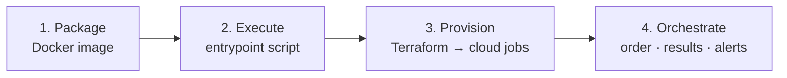
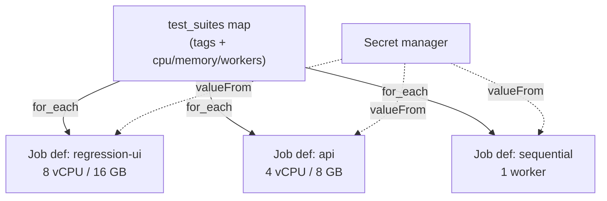
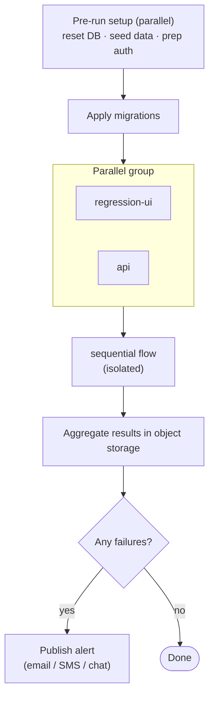

# Running Playwright in the Cloud: A Reusable CI/CD Pipeline with Docker, Terraform & AWS

> One container image, one suite‑as‑data definition, and an infrastructure‑as‑code pipeline that fans thousands of tests across the cloud — portable to GitHub Actions, GCP, or anywhere else.

A large Playwright suite eventually outgrows the laptop and the single CI runner. Thousands of tests against a real, multi‑service environment need *parallel compute*, *isolated resources per slice*, *centralised results*, and *alerting* — and you want all of it reproducible, not clicked together in a console.

This article walks through a cloud‑native execution pipeline built from four reusable building blocks: a **Docker image**, a **container entrypoint script**, **Terraform** that turns a suite definition into isolated cloud jobs, and an **orchestrator** that runs them in the right order with results and alerts. The specifics here use AWS, but every piece maps cleanly onto GitHub Actions, GCP, or any container platform — the design is deliberately portable.

---

## The shape of the problem

Running tests in the cloud has four concerns that are easy to tangle together and important to keep separate:



Keep these as distinct layers and each becomes replaceable: swap the orchestrator without touching the image, retarget the cloud without rewriting the test command, run the *exact same image* locally that runs in production.

---

## Block 1 — One Docker image, identical everywhere

The foundation is a single image built on the official Playwright base (browsers and OS deps pre‑installed), with whatever cloud CLI and tooling the run needs layered on top:

```dockerfile
FROM mcr.microsoft.com/playwright:v1.59.1-noble

WORKDIR /app
COPY . /app/

RUN apt update && apt install -y unzip zip jq python3 && \
    # install the cloud CLI used for uploading results / sending alerts
    curl "https://example-cloud-cli.zip" -o cli.zip && unzip cli.zip && ./install && \
    npm ci && \
    chmod +x /app/entrypoint.sh

ENTRYPOINT [ "/app/entrypoint.sh" ]
```

Two principles make this reusable:

- **Pin the Playwright version to match the project.** The base image tag and the `@playwright/test` dependency must agree, or browsers and the runner drift apart.
- **The image is environment‑agnostic.** It contains *no* URLs, credentials, or suite choices. Everything that varies is injected at run time through environment variables. That's what lets the same artifact run on a laptop via `docker compose` and in the cloud as a job.

A `docker-compose.yml` gives developers the identical container locally:

```yaml
services:
  ui-tests:
    build: ./
    network_mode: "host"
    command: >
      sh -c "npx bddgen --tags '@smoke and not @manual' &&
             ENV=local npx playwright test --project=chromium"
    volumes:
      - ./test-results:/app/test-results
      - ./playwright-report:/app/playwright-report
```

"Works on my machine" stops being a phrase, because *my machine* and *the cloud* are byte‑for‑byte the same image.

---

## Block 2 — The entrypoint: a portable run contract

The container's entrypoint script is the **contract** between the orchestration layer and the tests. It reads everything it needs from environment variables, runs the two‑stage generate‑then‑test flow, and handles results and alerting. Crucially, it's cloud‑logic kept *out* of the test code.

```bash
#!/bin/bash
set -e

# 1. Validate the run contract — fail fast if misconfigured
required=(ENV PLAYWRIGHT_TEST_TAGS TEST_RESULTS_BUCKET)
for v in "${required[@]}"; do
  [ -z "${!v}" ] && { echo "Missing $v"; exit 1; }
done

# 2. Defaults that callers may override
WORKERS="${PLAYWRIGHT_TEST_WORKERS:-6}"
RETRIES="${PLAYWRIGHT_TEST_RETRIES:-1}"

# 3. Generate the filtered set, then run it (don't abort on test failure)
npx bddgen --tags "$PLAYWRIGHT_TEST_TAGS"
set +e
npx playwright test --workers="$WORKERS" --retries="$RETRIES" \
  --max-failures="${PLAYWRIGHT_TEST_MAX_FAILURES:-25}"
set -e

# 4. Archive the report and push it to object storage
zip -q -r report.zip playwright-report/
upload report.zip "s3://${TEST_RESULTS_BUCKET}/${PLAYWRIGHT_TEST_NAME}.zip"

# 5. Inspect results and alert on failure
FAILURES=$(jq '.stats.unexpected' playwright-report/report.json)
if [ "$FAILURES" -gt 0 ]; then
  publish_alert "$FAILURES tests failed. Report: ${RESULTS_LINK}"
  exit 1
fi
```

A few patterns worth copying:

- **Fail fast on a missing contract.** Validating required env vars up front turns a 30‑minute mystery into an instant, clear error.
- **Don't let a test failure skip the upload.** Wrap the test command in `set +e` / `set -e` so results and alerts are produced *even when tests fail* — failed runs are exactly the ones you most want artifacts for.
- **Results are data.** Parsing the JSON report (`stats.unexpected`) lets the same script publish metrics, name the archive by failure count, and decide whether to alert.

This script never changes between suites or environments — only the variables passed to it do.

---

## Block 3 — Terraform turns "suite‑as‑data" into isolated cloud jobs

This is where the previous article's **suite‑as‑data** model pays off enormously. That map of `{ tags, workers, cpu, memory }` objects is *already* the specification for a fleet of cloud jobs. Terraform's `for_each` expands it into one isolated, right‑sized job definition per suite — no copy‑paste, no drift.

```hcl
# The single source of truth: suite name -> tags + resources
locals {
  test_suites = {
    regression-ui = { tags = "@regression and not @webservice", workers = 12, cpu = 8, memory = 16384 }
    api           = { tags = "@api", workers = 12, cpu = 4, memory = 8192 }
    sequential    = { tags = "@flow-sequential", workers = 1, cpu = 4, memory = 8192 }
  }
}

# One job definition per suite, generated from the map
resource "aws_batch_job_definition" "playwright" {
  for_each = local.test_suites

  name = "${var.env}-playwright-${each.key}"
  type = "container"
  platform_capabilities = ["FARGATE"]

  container_properties = jsonencode({
    image = "${var.ecr_repo}:${var.image_tag}"

    # Secrets injected from the secret manager — never baked into the image
    secrets = [
      { name = "APP_BASE_URL", valueFrom = var.app_base_url_arn },
      { name = "DB_PASSWORD",  valueFrom = "${var.db_secret_arn}:password::" },
    ]

    # The run contract: each suite's tags + profile become env vars
    environment = [
      { name = "PLAYWRIGHT_TEST_NAME",    value = each.key },
      { name = "PLAYWRIGHT_TEST_TAGS",    value = "${each.value.tags} and @preprod and not @manual" },
      { name = "PLAYWRIGHT_TEST_WORKERS", value = tostring(each.value.workers) },
      { name = "TEST_RESULTS_BUCKET",     value = var.results_bucket },
      { name = "ENV",                     value = var.env },
    ]

    resourceRequirements = [
      { type = "VCPU",   value = tostring(each.value.cpu) },
      { type = "MEMORY", value = tostring(each.value.memory) },
    ]
  })
}
```

The important ideas, all reusable on any platform:

- **The suite map is the single source of truth.** The same structure that runs locally provisions the cloud. Add a suite once; it appears everywhere.
- **Serverless containers per suite** (here, Fargate) mean each slice gets *its own* CPU/memory — a 12‑worker UI batch and a 1‑worker sequential flow no longer fight for the same box.
- **Secrets stay in a secret manager**, injected by reference (`valueFrom`) at launch. The image and the Terraform code carry *no* credentials.
- **The image is pinned by tag** (`${var.ecr_repo}:${var.image_tag}`), so a run is fully reproducible — you know exactly which code produced a result.



---

## Block 4 — Orchestration: order, parallelism, and a clean teardown

Individual jobs aren't enough; they need to run in the right order, with the right things overlapping — the *execution plan* from the previous article, now expressed as a cloud state machine. A serverless workflow engine (here, Step Functions) submits the jobs, runs parallel groups concurrently, and serialises the order‑dependent ones:



The orchestration layer adds the things a single job can't:

- **Pre‑flight setup as parallel branches** — resetting databases, seeding fixtures, and preparing auth pools concurrently before any test runs, so every run starts from a known state.
- **Mixed parallel/sequential execution** — exactly the two‑level model from the suite definitions, now enforced by the workflow engine.
- **Centralised results and alerting** — every job uploads its archive to one bucket; failures fan out to email/SMS/chat from one place.
- **Scheduling** — a scheduled trigger (cron‑style) kicks the whole workflow nightly with zero human involvement.

---

## Why this is portable

Nothing here is fundamentally AWS‑shaped. The four blocks map onto any stack:

| Concern | AWS here | GitHub Actions | GCP |
|---|---|---|---|
| Package | Docker + ECR | Docker + GHCR | Docker + Artifact Registry |
| Execute | entrypoint.sh | entrypoint.sh (unchanged) | entrypoint.sh (unchanged) |
| Provision per‑suite | Batch on Fargate | matrix jobs / containers | Cloud Run Jobs |
| Orchestrate | Step Functions | workflow `needs:` graph | Workflows |
| Secrets | Secrets Manager | Actions secrets | Secret Manager |
| Results/alerts | S3 + SNS | artifacts + notifications | GCS + Pub/Sub |

The two things that *don't* change across all of these are the **container image** and the **entrypoint contract**. That's the whole point: by pushing all cloud‑specific wiring into the provisioning and orchestration layers — and keeping the test runtime as a self‑contained, env‑driven image — you can lift the entire pipeline onto a different platform by rewriting only the outer two blocks.

---

## Lessons learned

- **One image, injected config.** A credential‑free, environment‑agnostic image is what lets the same artifact run on a laptop and in production unchanged.
- **Make the entrypoint a contract.** Validate required env vars, run generate‑then‑test, and *always* produce results and alerts — even on failure.
- **Let your suite‑as‑data drive the infrastructure.** `for_each` over the suite map gives one right‑sized, isolated job per slice with zero duplication.
- **Isolate compute per suite.** Serverless containers stop a heavy parallel batch and a delicate sequential flow from sharing — and starving — the same machine.
- **Orchestrate order, centralise results.** A workflow engine enforces parallel/sequential structure; one bucket and one alert path keep observability simple.
- **Keep cloud logic in the outer layers.** Push all platform specifics into provisioning and orchestration so the runtime stays portable.

The result is a test pipeline that is reproducible, parallel, observable, and cloud‑portable — built from a handful of small, replaceable parts. Define a suite once as data; the image runs it, Terraform provisions it, and the orchestrator schedules it. Moving to a new cloud is a weekend, not a rewrite.

---

*Written from real‑world experience building a large, multi‑environment Playwright suite. All names, values, infrastructure identifiers, and examples are generic illustrations of the patterns described.*
