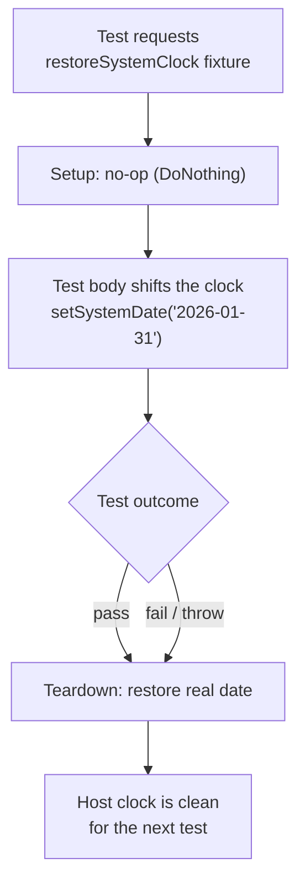

# Time‑Travel Testing in Playwright: Automating Date‑Sensitive Flows

> Some bugs only appear on the last day of the month, on a leap year, or 30 days after sign‑up. Here's how to make those moments reproducible by controlling the clock — and how to put time back when the test ends.

A surprising amount of software behaviour depends on *what day it is*. Billing cycles, subscription renewals, free‑trial expiries, statement generation, "due in 7 days" reminders, weekend vs weekday logic, month‑end rollups — none of these can be tested honestly by waiting for the calendar to cooperate. You need to **travel in time**.

This article covers a pragmatic time‑travel technique for end‑to‑end Playwright tests: shifting the **host system clock** so the whole stack — browser, app, and backend — agrees it's a different day, then guaranteeing the clock is restored no matter how the test ends.

> There are two flavours of time control. We'll start with the lightweight in‑browser approach, then move to the heavyweight system‑clock approach for true full‑stack date travel.

---

## Two ways to fake time (and when each fails)

**1. Browser‑only mocking.** Playwright can freeze or shift the clock *inside the page*:

```js
await page.clock.setFixedTime(new Date("2026-01-31T09:00:00"));
```

This is fast, isolated, and perfect when the date logic lives in the **front end** — a countdown, a "renews on" label computed client‑side, relative timestamps.

But it has a hard limit: it only fools `Date` in the browser tab. The moment your *backend* stamps a record with its own server time, or a downstream service decides "today is the 31st," the illusion breaks. The page thinks it's month‑end; the server disagrees.

**2. System‑clock travel.** For genuinely full‑stack date behaviour — where the *server* must believe it's a different day — you shift the clock of the machine the whole stack runs on. Heavier and more invasive, but it's the only thing that makes the entire system agree on "now."

The rest of this article is about doing (2) safely.

---

## Shifting the host clock from a test helper

In an environment where the app, services, and tests share a host (a local dev box or a self‑contained CI container), a small helper can set the OS date by shelling out to the system:

```js
const { exec } = require("child_process");
const util = require("util");
const execAsync = util.promisify(exec);

export async function setSystemDate(dateString) {
  // dateString: "YYYY-MM-DD"
  const [year, month, day] = dateString.split("-");

  // Apply the new date via the OS date command, then let services settle
  await applyOsDate({ year, month, day });
  await wait(5000); // give the stack a moment to observe the new clock

  // Always verify the change actually took effect
  const now = await readOsDate();
  console.log(`System date is now: ${now}`);
}
```

Two non‑obvious but important details:

- **Settle, then verify.** After changing the clock, wait briefly and *read it back*. Date changes aren't always instantaneous, and a silent failure here produces baffling test results ("why is it still yesterday?"). Verifying turns a heisenbug into a clear log line.
- **Treat it as environment mutation, not test data.** Changing the host clock affects *everything* on that host — every parallel worker, every service. That has consequences we'll address head‑on below.

Exposed as a single helper, the test reads cleanly:

```js
test("invoice is generated on the last day of the month", async ({ page }) => {
  await setSystemDate("2026-01-31");
  await triggerBillingRun(page);
  await expectInvoiceVisible(page);
});
```

---

## The real problem: putting time back

Here's the trap. The test above *works* — until it fails halfway through, or someone adds an early `return`, and the clock is left in the past. Now every subsequent test on that host is silently running in the wrong year. One forgotten restore poisons the entire run.

A `try/finally` helps, but it's easy to forget and easy to bypass. The robust answer is a **teardown‑only fixture** that restores the real date *after every test that touches time*, guaranteed, pass or fail:

```js
restoreSystemClock: async ({}, use) => {
  await use(new DoNothing());        // setup: hand back a no-op
  const today = new Date().toISOString().split("T")[0];
  await setSystemDate(today);        // teardown: ALWAYS restores real date
},
```

A date‑sensitive test opts into the guarantee simply by **listing the fixture** — it never writes cleanup code:

```js
test("trial expires 30 days after signup", async ({ page, restoreSystemClock }) => {
  await signUp(page);
  await setSystemDate(daysFromNow(30)); // jump forward
  await expectTrialExpired(page);
  // no restore here — the fixture resets the clock on teardown, even on failure
});
```

Because Playwright runs fixture teardown in reverse order regardless of outcome, the clock is *always* put back. This converts "remember to undo your time change" from a code‑review hope into a structural guarantee.



---

## Synchronising on server time, not local time

Once the *server* owns "now," your assertions must trust the *server's* clock, not the test process's. A subtle but real source of flakiness is reading `new Date()` in the test and comparing it to a timestamp the server produced moments later — clock skew of even a second or two breaks "is this after that?" checks.

The fix is to anchor on server time explicitly:

```js
noteServerTime: async ({ request }, use, runTimeCache) => {
  const serverNow = await getServerTime(request); // ask the app, not the OS
  runTimeCache.notedTime = serverNow;
  await use();
},
```

```js
test("reminder fires after the due date", async ({ page, request }) => {
  const before = await getServerTime(request);   // server's clock
  await advanceSystemDateBy({ days: 8 });
  await triggerReminderJob(page);
  const stamped = await readReminderTimestamp(page);
  expect(stamped).toBeGreaterThan(before);        // compare server-to-server
});
```

> Rule of thumb for date tests: **whoever owns the source of truth for "now" is who you compare against.** If the backend stamps records, read the backend's clock — never assume the test runner's clock matches.

---

## Keeping clock‑travel tests off the parallel highway

Mutating a shared host clock is fundamentally **global**: it affects every test running on that host simultaneously. Two tests time‑travelling to different dates in parallel will corrupt each other. So these tests must be treated as a special, serialised class:

- **Isolate them.** Run clock‑sensitive tests with a single worker, or pin them to a dedicated execution slice that never overlaps with others (the per‑suite concurrency model: wide workers for independent tests, *one* worker for time‑travel flows).
- **Tag them** so they can be selected, scheduled, and *excluded* deliberately — you don't want a date‑shifting test sneaking into a wide parallel batch.
- **Always pair them with the restore fixture**, so even a crash leaves the next suite a clean clock.

This is the price of full‑stack time travel: it buys you honest end‑to‑end date behaviour, at the cost of giving up parallelism for that slice. For the handful of genuinely date‑critical journeys, it's a trade worth making — and for everything else, the lightweight in‑browser `page.clock` approach keeps its parallelism.

---

## Lessons learned

- **Pick the right altitude.** In‑browser `page.clock` for front‑end date logic; system‑clock travel only when the *server* must agree on the date.
- **Settle and verify after changing the clock.** A read‑back log line turns silent date failures into obvious ones.
- **Make restoration structural, not optional.** A teardown‑only fixture guarantees the clock is reset on pass, fail, or crash — the single most important safeguard.
- **Compare against the clock that owns the truth.** If the backend stamps "now," read the backend's time; never trust cross‑process clock equality.
- **Serialise and tag clock‑travel tests.** Global state can't run in parallel — isolate it, label it, and keep it out of wide batches.

Date‑sensitive behaviour is some of the highest‑value, lowest‑covered surface area in most applications. With a small clock helper, a teardown guard, and a bit of execution discipline, those once‑a‑month and once‑a‑year code paths become tests you can run any day you like.

---

*Written from real‑world experience building a large, multi‑environment Playwright suite. All names, values, and examples are generic illustrations of the patterns described.*
