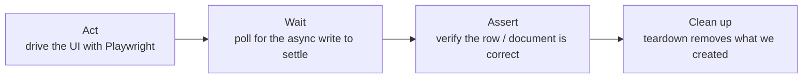

# Don't Just Test the Screen: Verifying Database & Message Side Effects in Playwright

> A green UI assertion can hide a broken backend. Here's how to drive the front end with Playwright and then assert on the database and message store to prove the *system* actually did the right thing.

End‑to‑end tests usually stop at the surface: click the button, see the success banner, pass. But the banner only proves the *page* reacted — not that the order was written, the relational row was created, the document landed in the right collection, or the downstream record carries the right values. Some of the nastiest production bugs live precisely in that gap: the screen says "done," the data says otherwise.

This article is about closing that gap. We'll drive the UI with Playwright and then **assert on backend side effects** — relational rows and document‑store records — using connection fixtures, polling for asynchronous writes, and deep object matching. The result is a test that verifies the *system*, not just the view.

---

## The pattern: act on the UI, assert on the data

The structure of a side‑effect test is always the same three beats:



The middle beat — *wait* — is what separates a reliable data assertion from a flaky one, because backend writes are rarely synchronous with the UI response. We'll come back to it.

---

## Step 1 — Database access as a worker‑scoped fixture

Opening a database connection per test would be slow and wasteful across thousands of tests. Instead, expose the connection as a **worker‑scoped fixture**: created once per worker process, reused by every test that worker runs, and closed automatically at the end.

```js
dbConnection: [async ({}, use) => {
  const db = new DbConnection();
  await db.connect();
  await use(db);        // shared across all tests in this worker
  await db.close();     // teardown when the worker finishes
}, { scope: "worker" }],

docStore: [async ({}, use) => {
  const store = DocStoreConnection.getInstance();
  await store.connect();
  await use(store);
  await store.close();
}, { scope: "worker" }],
```

The connection wrapper itself stays thin — connect, run a parameterised query, close:

```js
class DbConnection {
  async query(sql, args) {
    const [rows] = await this.connection.execute(sql, args); // parameterised
    return rows;
  }
}
```

> **Security note:** always use *parameterised* queries (`execute(sql, args)`), never string‑concatenate test values into SQL. Test code that builds queries from data is just as injectable as production code — and test data often comes from external sources.

A test now requests the connection like any other dependency, with zero setup code:

```js
test("submitting the form persists an order", async ({ page, dbConnection }) => {
  await submitOrderForm(page);
  // ... assert against dbConnection
});
```

---

## Step 2 — Poll for asynchronous writes (don't sleep)

The single biggest cause of flaky data assertions is asserting *too early*. The UI returns, the test queries the database, and the row isn't there yet — because a queue, a worker, or an async handler hasn't finished. The wrong fix is `await wait(5000)`: too short and it's flaky, too long and it's slow.

The right fix is a **poll‑until‑present** helper that retries on an interval up to a timeout:

```js
async function pollForRecord(db, email, intervalMs = 2000, timeoutMs = 60000) {
  const deadline = Date.now() + timeoutMs;
  while (Date.now() < deadline) {
    const rows = await db.query(
      "SELECT * FROM orders WHERE customer_email = ? AND is_active = 1",
      [email]
    );
    if (rows.length > 0) return rows;     // success — return as soon as it appears
    await wait(intervalMs);
  }
  throw new Error(`No active order appeared for ${email} within ${timeoutMs}ms`);
}
```

This is the database equivalent of Playwright's web‑first auto‑waiting: assert on a *condition becoming true*, not on a fixed delay. It's fast when the write is fast, patient when it's slow, and it fails with a clear message instead of a mysterious empty result.

```js
test("order is written to the database after submission", async ({ page, dbConnection }) => {
  const email = await submitOrderForm(page);
  const [order] = await pollForRecord(dbConnection, email);

  expect(order.status).toBe("active");
  expect(Number(order.amount)).toBe(250);
});
```

---

## Step 3 — Deep‑match documents against expected data

Relational checks are usually a few columns. Document stores are different: you often want to assert that a *whole nested document* matches an expected shape — but only the fields you care about, ignoring volatile ones like generated IDs and timestamps.

Hand‑writing dozens of `expect(doc.a.b.c).toBe(...)` lines is brittle. A better approach is a **deep, partial matcher** that compares an actual document against an expected fixture, with support for "ignore this field" markers:

```js
test("the stored document matches the expected shape", async ({ docStore }) => {
  const expected = await loadExpectedJson("order-created-expected.json");
  const actual   = await docStore.findLatestFor(testUser.email);

  // Partial deep match: every field in `expected` must match `actual`;
  // fields marked as "#ignore" (ids, timestamps) are skipped.
  match(actual, expected);
});
```

```json
{
  "type": "ORDER_CREATED",
  "customer": { "email": "buyer@example.test", "tier": "standard" },
  "amount":   250,
  "id":        "#ignore",
  "createdAt": "#ignore"
}
```

Keeping the expected shape as a **data file** (resolved through the same environment/variant fallback your other test data uses) means contributors update expectations by editing JSON, not test code — and the matcher reports the exact path of any mismatch (`customer.tier: expected 'standard', got 'premium'`), which makes failures self‑explaining.

---

## Step 4 — Cleanup is part of the test, not an afterthought

Side‑effect tests *create* side effects. Left unattended, those accumulate and eventually cause the very collisions that make suites flaky — a "user already exists," a stale record matched by the next run. So cleanup must be reliable and, ideally, automatic.

Two complementary tactics:

**Targeted teardown via a fixture** — the test declares what it touched, and a fixture removes it afterward regardless of outcome:

```js
cleanupCreatedOrders: async ({ dbConnection, testUser }, use) => {
  await use(new DoNothing());                 // setup: nothing
  await deactivateOrdersFor(dbConnection, testUser.email); // teardown: always
},
```

**Defensive pre‑cleanup** — before a test that depends on a clean slate, proactively neutralise any leftovers from prior runs using a forgiving (fuzzy) match across the identifiers a user might be recognised by:

```js
async function purgeLeftovers({ db, docStore, user }) {
  await clearDocCacheFor(docStore, user);            // doc store
  const ids = await findRelatedIds(db, user);        // fuzzy: email, phone, name+dob
  if (ids.length === 0) return;
  await deactivateOrders(db, ids);
  await deleteAuthRecord(ids[0]);
  await deactivateProfiles(db, ids);
}
```

> The fuzzy‑match cleanup matters because real systems recognise the same person through several keys (email, normalised phone, name + date of birth + postcode). Cleaning by a single key leaves orphans that the *next* test trips over. Match the way the system matches.

---

## Putting it together

A complete side‑effect test reads as one clear story — act, wait, assert across layers, and let teardown clean up:

```js
test("a completed purchase is consistent across UI, database, and document store",
  async ({ page, dbConnection, docStore, cleanupCreatedOrders }) => {
    // ACT — front end
    const email = await completePurchase(page);
    await expect(page.getByText("Order confirmed")).toBeVisible();

    // WAIT + ASSERT — relational
    const [order] = await pollForRecord(dbConnection, email);
    expect(order.status).toBe("active");

    // ASSERT — document store
    const doc = await docStore.findLatestFor(email);
    match(doc, await loadExpectedJson("order-created-expected.json"));

    // CLEANUP happens automatically via the fixture
  }
);
```

The UI assertion proves the user saw success; the database and document assertions prove the *system* delivered it. That's the difference between testing the screen and testing the software.

---

## Lessons learned

- **A green UI isn't proof of a correct backend.** Assert on the data the action was supposed to produce, not just the banner that says it did.
- **Share connections per worker.** Worker‑scoped fixtures give you pooling for free and guarantee the connection is closed.
- **Poll, never sleep.** Retry until the asynchronous write appears, with a clear timeout error — the data‑layer equivalent of auto‑waiting.
- **Deep‑match documents from data files.** A partial matcher with "ignore" markers keeps assertions robust against volatile fields and lets non‑coders maintain expectations.
- **Clean up the way the system identifies users.** Fuzzy, multi‑key cleanup (and teardown fixtures) prevent the orphaned records that make suites flaky over time.
- **Parameterise every query.** Test SQL is production‑grade attack surface; never concatenate values.

Reaching past the browser into the database and message store turns "it looked like it worked" into "it provably worked." For the journeys that really matter, that extra layer of truth is what makes an end‑to‑end test actually end‑to‑end.

---

*Written from real‑world experience building a large, multi‑environment Playwright suite. All names, values, schema, and examples are generic illustrations of the patterns described.*
