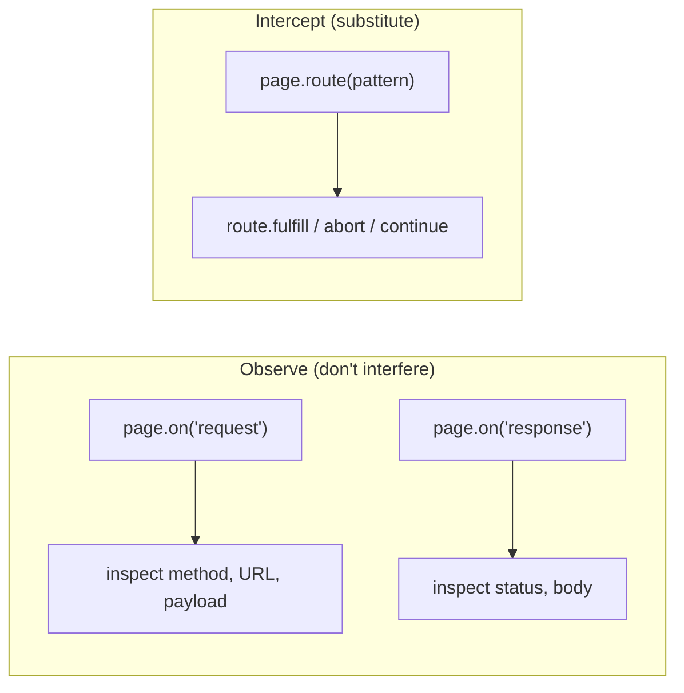
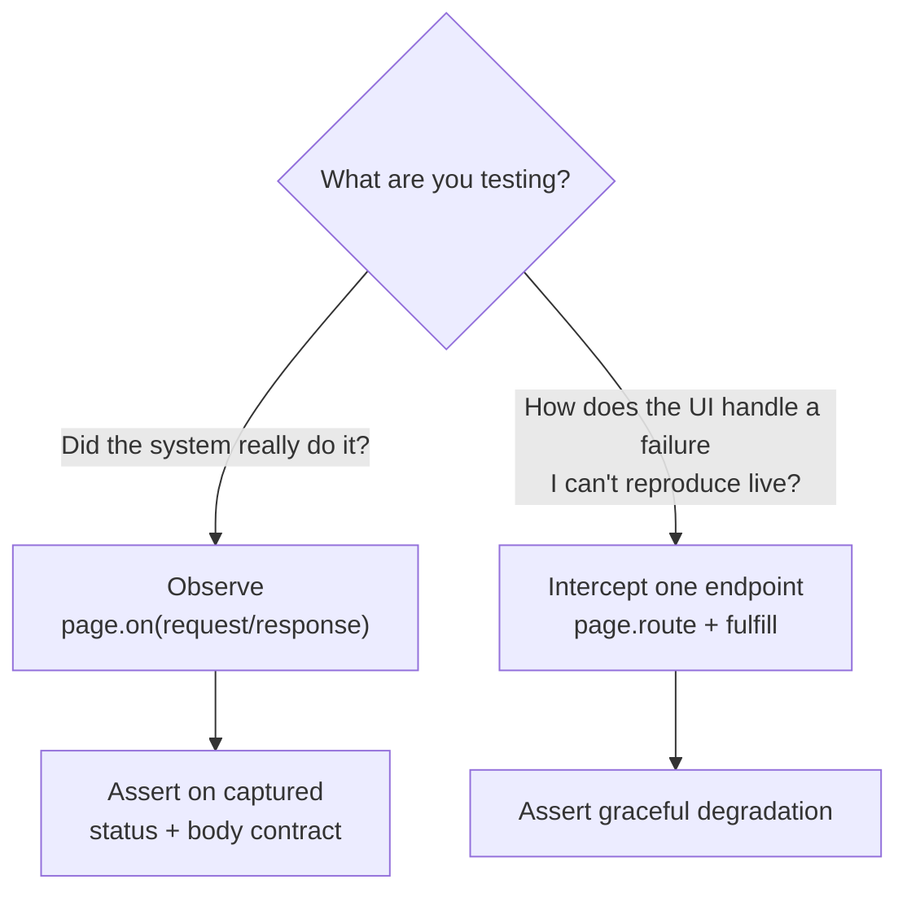

# Beyond Mocking: Capturing Real Network Traffic and Validating Response Contracts

> Most teams use request interception to *fake* responses. The more powerful use is the opposite — let the real traffic flow, capture it, and assert that the page actually called the right APIs and got the right answers.

Request mocking is the first thing people reach for with Playwright's network layer: stub an endpoint, return canned JSON, test the UI in isolation. That's useful. But it answers the wrong question for an end‑to‑end test. Mocking proves *"the page renders correctly when the API behaves"* — it says nothing about whether the API was even called, in the right order, with the right payload, returning the right shape.

This article is about using the same network primitives for **observation and contract validation** instead of substitution: attaching listeners during a real user journey, capturing the actual requests and responses, and asserting on them. It also covers the targeted, surgical use of mocking — forcing a failure you can't otherwise reproduce. All endpoint and host names here are generic placeholders.

---

## Two modes of network control

Playwright gives you two distinct hooks, and the distinction is the whole article:



- **`page.on('request')` / `page.on('response')`** are *passive listeners*. Traffic flows normally to and from the real backend; you simply get a callback for every request and response to inspect. Nothing is changed.
- **`page.route(pattern, handler)`** is an *active interceptor*. You decide what happens — fulfil with a fake body, change the status, or let it continue. This is mocking.

The mistake is using `route` for everything. If your goal is to prove the system worked, you want to *watch*, not *replace*.

---

## Pattern 1 — Extract a value the UI never shows you

The simplest observation use: a journey triggers a backend call that returns an identifier you need later (to query a database, to assert a side effect), but the UI never displays it. Attach a response listener, watch for that call, pull the value out.

```js
export const captureLeadIdFromSync = async ({ journeyData, runtimeCache }, page, loanId) => {
  page.on('response', async (response) => {
    // Watch for the sync call; only act on a successful one
    if (response.url().includes('/api/public/lead/sync') && response.status() === 200) {
      const body = await response.json();
      const leadId = body.userData.leadId;

      journeyData[loanId].leadId = leadId;      // make it available downstream
      runtimeCache.LEAD_ID = leadId;
      console.log(`Captured leadId from network traffic: ${leadId}`);
    }
  });
};
```

The test does nothing special afterward — it just runs the journey. The listener fires whenever that call happens, and the value lands in the cache for later steps to use. You've turned the network into a **data source** without touching the UI or the backend.

> Attach the listener *before* the navigation or action that triggers the call. Listeners only catch traffic that happens after they're registered.

---

## Pattern 2 — Validate the response contract during a real journey

This is the heart of it. Instead of asserting only on what the screen shows, capture the API responses the page made and assert they match the **contract** you expect: the call happened, the status is right, the body has the right shape and values.

Start capturing into a buffer, run the journey, then assert on what was collected:

```js
When('I start capturing address and lead-processor responses', async ({ page, runtimeCache }) => {
  runtimeCache.capture = { addressFind: [], addressRetrieve: [], leadProcessor: [] };

  const listener = async (response) => {
    const url = response.url();
    const status = response.status();
    const method = response.request().method();

    if (method === 'GET' && url.includes('/address/find')) {
      runtimeCache.capture.addressFind.push({ url, status });
    } else if (method === 'GET' && url.includes('/address/retrieve')) {
      runtimeCache.capture.addressRetrieve.push({ url, status });
    } else if (method === 'POST' && url.includes('/lead-processor')) {
      let body = null;
      try { body = await response.json(); } catch { body = null; }
      runtimeCache.capture.leadProcessor.push({ url, status, body });
    }
  };

  runtimeCache.captureListener = listener;   // keep a handle so we can detach later
  page.on('response', listener);
});
```

The validation step then makes the assertions a mock could never make — that the page *actually reached the real services*:

```js
Then('I validate the captured network responses', async ({ page, runtimeCache }) => {
  const logs = runtimeCache.capture;
  try {
    // 1. The call happened at all. A zero-length buffer means the page never
    //    called the API — a real bug a UI-only assertion would miss entirely.
    expect(logs.addressFind.length,
      'address/find was never called — the page did not trigger lookup, or the API is unreachable'
    ).toBeGreaterThan(0);

    // 2. Every captured call returned a healthy status.
    for (const r of logs.addressFind) {
      expect(r.status, `address/find should return 200, got ${r.status}`).toBe(200);
    }

    // 3. The response body matches the expected contract.
    const last = logs.leadProcessor.at(-1);
    expect(last.body, 'lead-processor body should be valid JSON').toBeTruthy();
    expect(last.body.response).toBe(501);
    expect(last.body.message?.error).toBe('No matching product found!');
  } finally {
    page.off('response', runtimeCache.captureListener);   // always detach
  }
});
```

Three classes of bug this catches that mocking and UI assertions both hide:

- **The silent no‑call.** The page rendered "success," but it never actually hit the endpoint. An empty capture buffer fails loudly.
- **The wrong status.** The screen swallowed a 500 and showed a cached state. The capture records the real status.
- **The contract drift.** The backend changed a field name or response code. Your UI happened to still render, but the *contract* broke — and the body assertion catches it.

---

## Pattern 3 — Surgical mocking to force the unreachable failure

Observation is the default, but mocking earns its place for one job: reproducing a failure you *cannot* trigger against the real backend on demand — a 500, an empty payload, a timeout. Here `page.route` is exactly right, scoped to a single endpoint:

```js
When('the repayable-amount API returns an empty body', async ({ page }) => {
  await page.route('**/api/public/payments/repayable-amount-calc', (route) =>
    route.fulfill({ contentType: 'application/json', body: JSON.stringify({}) })
  );
});

When('the repayable-amount API returns a 500', async ({ page }) => {
  await page.route('**/api/public/payments/repayable-amount-calc', (route) =>
    route.fulfill({ contentType: 'application/json', status: 500 })
  );
});
```

Now you can assert the UI degrades gracefully — an error banner, a retry, a safe default — for conditions the real environment almost never produces. Keep these routes **narrow** (one URL pattern) and **temporary** (per test), so the rest of the journey still talks to the real system.



---

## Lessons learned

- **Default to observing, not replacing.** Passive `request`/`response` listeners prove the system actually did the work; mocks only prove the UI renders when fed canned data.
- **An empty capture buffer is a real failure.** "The call never happened" is one of the most common — and most invisible — end‑to‑end bugs. Assert that expected traffic *occurred*.
- **Validate the contract, not just the screen.** Status codes and response‑body shape are part of the system's behaviour; assert on them directly so backend drift fails your test, not production.
- **Attach before you act; detach in a `finally`.** Listeners only catch traffic registered before the trigger, and leaked listeners across tests cause cross‑talk. Always clean up.
- **Reserve `page.route` for the unreproducible.** Forcing a 500 or empty body is mocking's best use — scoped to one endpoint, for one test — so the rest of the journey stays real.
- **Keep endpoint names out of assertions where you can.** Match on stable path fragments, not full hosts, so tests survive environment and infrastructure changes.

Mocking asks "does the page look right when I lie to it?" Observation asks "did the software actually do what it claimed?" For an end‑to‑end suite, the second question is the one worth answering — and the network layer answers it without you touching a single line of production code.

---

*Written from real‑world experience building a large, multi‑environment Playwright suite. All endpoint names, hosts, payloads, and examples are generic illustrations of the patterns described.*
