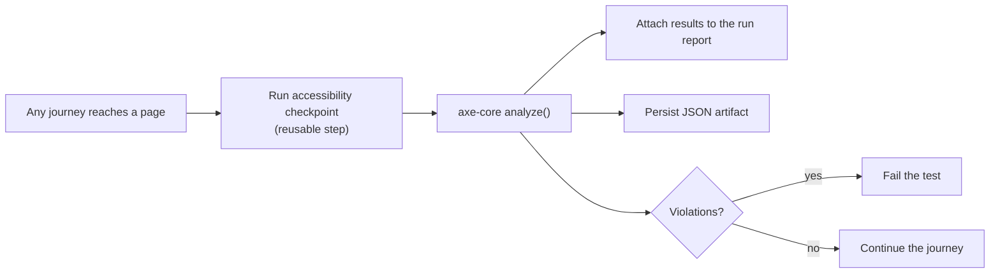

# Accessibility Testing at Scale: From One‑Off axe Script to a Tagged, Gated, Reported Suite

> A single `axe-core` script in a corner of the repo is easy to ignore. Wiring accessibility checks into the *same* tag‑driven, fixture‑backed, reported pipeline as your functional tests is what makes them actually stick.

Most teams' accessibility story is a script someone wrote once, ran a few times, and quietly abandoned. It lives outside the main suite, isn't gated in CI, produces a report nobody reads, and rots. The technology — `axe-core` — is excellent. The *integration* is the problem.

This article is about treating accessibility as a first‑class citizen of a large Playwright‑BDD suite: a reusable step that any scenario can call, the same tags that drive functional execution, machine‑readable reports attached to every run, and a hard gate that fails the build on a violation. Low sensitivity throughout — nothing here is product‑specific.

---

## The shift: a checkpoint, not a separate suite

The key mental move is to stop thinking of accessibility as "a kind of test" and start thinking of it as **a checkpoint you can drop into any journey**. A page worth functionally testing is a page worth scanning. So the scan becomes a reusable step, callable both as a standalone scenario *and* inline mid‑journey.



---

## Step 1 — One reusable, fixture‑backed step

The whole scan is a single BDD step that takes the current `page` (already navigated by whatever journey called it), a page name for reporting, and a device label. Because it's wired through the suite's fixtures, it inherits `brand`, `env`, and the report‑attachment helpers for free.

```js
import AxeBuilder from '@axe-core/playwright';

const runAccessibilityTest = Given(
  'Run accessibility tests pageName:{string} device: {string}',
  async ({ page, $testInfo, brand, env }, pageName, device) => {
    // 1. Scan the page exactly as the user currently sees it
    const results = await new AxeBuilder({ page }).analyze();

    // 2. Persist a machine-readable artifact, keyed by everything that varies
    await saveAccessibilityReport(brand, env, pageName, device, results);

    // 3. Attach violations to the live run report (visible in HTML/trace)
    await attachJsonDataToTestReport($testInfo, 'accessibility-scan-results', results.violations);

    // 4. The gate: zero violations or the test fails
    expect(results.violations).toEqual([]);
  }
);
```

Two design choices do the heavy lifting:

- **It scans the *current* DOM.** Because the step takes whatever `page` it's handed, it tests the page in its real, post‑interaction state — after cookies are accepted, a form is filled, a modal is open — not a cold initial load.
- **`expect(violations).toEqual([])` is the gate.** A violation isn't a warning logged to a file nobody reads; it fails the test like any other assertion. Accessibility becomes non‑optional.

---

## Step 2 — Call it two ways: standalone and inline

The same step serves both audiences. A dedicated accessibility feature scans key pages in isolation:

```gherkin
@accessibility @prod @qa @local @preprod
Feature: accessibility tests for application pages

  Scenario Outline: a11y scan — page: "<pageName>", device: "<device>"
    Given I access the application start page
    Given Run accessibility tests pageName:"<pageName>" device: "<device>"

    Examples:
      | pageName            | device  |
      | application-start   | desktop |
      | application-details | desktop |
```

And a *functional* journey can drop the same checkpoint in mid‑flow, scanning each page as the user reaches it — accessibility coverage with zero extra navigation cost:

```js
await goToWelcomePage(page);
await runAccessibilityTest({ page, $testInfo, brand, env }, 'welcome-page', device);

await fillDetailsAndContinue(page);
await runAccessibilityTest({ page, $testInfo, brand, env }, 'details-page', device);
```

This is the payoff of the reusable‑step design: every functional journey you already have is a potential accessibility journey, for free.

---

## Step 3 — Tags make a11y a slice of the pipeline, not a special case

In a tag‑driven suite, accessibility is just another tag family member. The scenarios carry `@accessibility` alongside the usual environment tags, so the exact same execution machinery selects them:

```bash
# Run only the accessibility slice, preprod, skipping manual-only specs
npx bddgen --tags "@accessibility and @preprod and not @manual"
npx playwright test
```

And because it's a tag, it slots straight into the **suite‑as‑data** model that provisions cloud jobs — accessibility gets its own right‑sized batch with no new infrastructure:

```js
const testSuites = {
  accessibility: { tags: "@accessibility", workers: 8, retries: 2, cpu: 4, memory: 8192 },
  // ...other functional suites
};
```

No bespoke runner, no separate CI job to maintain. Accessibility runs, retries, reports, and alerts exactly like everything else.

---

## Step 4 — Reports as artifacts, not console noise

A violation that scrolls past in a log is forgotten by lunch. Two outputs make findings durable and actionable:

**A persisted JSON file per scan**, keyed by every dimension that matters, so results are diffable across runs and comparable across brands/devices:

```js
async function saveAccessibilityReport(brand, env, pageName, device, results) {
  const filepath = path.join(
    reportsDir,
    `${device}-${env}-${brand}-${pageName}.json`   // e.g. desktop-preprod-acme-checkout.json
  );
  await ensureDirectoryExistence(filepath);
  await fs.writeFile(filepath, JSON.stringify(results, null, 2));
}
```

**An attachment on the live run report**, so a failing test shows *which* rules failed right next to the trace and screenshot — no hunting through a separate folder.

The naming convention (`device-env-brand-page.json`) means a CI archive of these files is a complete, sortable accessibility snapshot of the whole product surface for that run.

---

## Step 5 — Tuning the gate without weakening it

A zero‑tolerance gate is the goal, but real products have edge cases — a third‑party widget you don't control, a known issue with a tracked fix. The disciplined ways to handle these, in order of preference:

- **Scope the scan** to the part of the page you own, excluding an embedded third‑party region — rather than disabling the whole check.
- **Disable a specific rule with a documented reason**, never a blanket suppression. The intent stays visible in the test.
- **Tag the known‑failing scenario** so it's tracked and reportable, not silently deleted.

```js
const results = await new AxeBuilder({ page })
  .exclude('#third-party-widget')   // not ours to fix; scan everything else strictly
  .analyze();
```

The principle: narrow the scope explicitly, never lower the bar silently. A suppression with a reason is a decision; a deleted assertion is a blind spot.

---

## Lessons learned

- **Make the scan a reusable step, not a script.** A single fixture‑backed step that any scenario can call turns every functional journey into potential accessibility coverage at no extra cost.
- **Scan the live DOM, mid‑journey.** Testing the page in its real post‑interaction state finds issues a cold initial‑load scan never will.
- **Gate, don't log.** `expect(violations).toEqual([])` makes accessibility a build‑failing assertion instead of a report nobody opens.
- **Reuse the tag pipeline.** `@accessibility` plugs straight into the same selection, parallelism, retry, and cloud‑provisioning machinery as functional tests — zero bespoke infrastructure.
- **Persist keyed JSON artifacts.** Reports named by device/env/brand/page are diffable, archivable, and give a full snapshot of the product surface per run.
- **Narrow scope explicitly; never weaken the gate silently.** Exclude a region or disable a rule *with a reason* — a documented decision beats a deleted assertion.

Accessibility tooling has been solved for years; `axe-core` is rock‑solid. What fails is integration. Fold the scan into the same tagged, fixture‑backed, gated, reported pipeline your functional tests already run in, and accessibility stops being a periodic chore and becomes a property the suite continuously enforces.

---

*Written from real‑world experience building a large, multi‑environment Playwright suite. All page names, brands, and examples are generic illustrations of the patterns described.*
